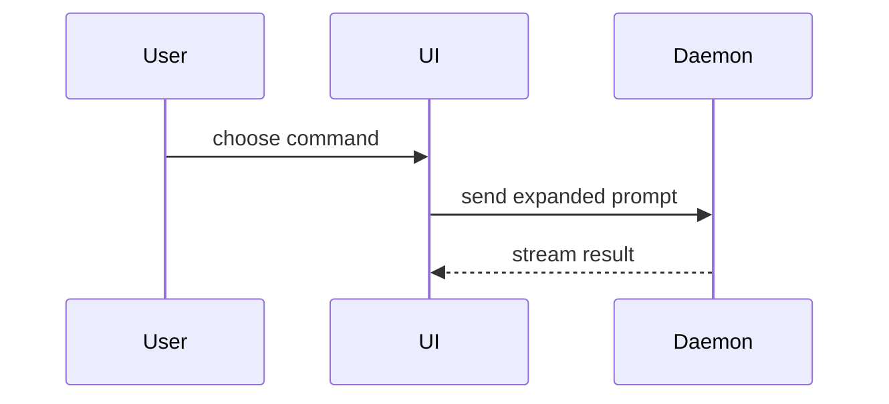

# Opening a PR

All changes reach `trunk` through a squash-merged PR. Direct pushes to `trunk` are blocked.

## 1. Sync with trunk

- Rebase onto the latest remote trunk: `git pull --rebase origin trunk`.

## 2. Branch and commit

- Branch off `trunk`: `git checkout -b <type>/<short-name> trunk`.
- Commit with the convention (enforced by the commit-msg hook): a `type(scope): summary` header, then `- ` bullet body lines only. Trailers (`Co-Authored-By`, etc.) are rejected.
  - **type** and **scope** come from the allowlist published in README.md's "Commit convention"
    section, which the hooks and the `PR Title` check parse directly. Read it there rather than
    from a copy here — a copy is exactly what drifts. For server domain work, use the owning slice
    (`apps/server/ARCHITECTURE.md` §2); otherwise use the matching cross-cutting scope.
  - Print the current list without leaving the terminal:
    `bun scripts/check-commit-message.ts /dev/null`

## 3. Create the PR

- **Title** must follow `type(scope): summary` — the `PR Title` CI check enforces it, because the squashed `trunk` subject is taken from the PR title.
- **Body** must follow the template and guidance below.
- Create it with `gh pr create --base trunk --title "type(scope): summary" --body-file - <<'EOF'`, followed by the body and a closing `EOF`.

### PR body

Use this template:

```markdown
## Summary

<diagram, diff-sketch, or tree>

## Evidence

- **Before:** <screenshot/output/failing test run>
  **After:** <screenshot/output/passing test run>

## Merge Danger

**Door:** one-way or two-way
**Blast Radius:** <potential ramifications of merge>
```

Skip all preambles and keep prose brief. Use the user's domain language from `CONTEXT.md`.

#### Summary

Pick the smallest view that makes the key point clear.

- Show logic or an algorithm as pseudocode:

```text
on(save)
  if content is unchanged
    return cached result
  write new content
  return fresh result
```

- Show runtime control flow as a call tree:

```text
submitForm
  createSession
    persistPrompt
    launchAgent
  navigateToSession
```

- Show UI structure as a component tree, including state and module boundaries that matter:

```tsx
<SessionPage>(apps / example / src / routes / session.tsx);
useSessionEvents() < SessionToolbar > <RunSkillButton>(packages / ui);
```

- Show file responsibility or a broad refactor as a shallow file tree:

```text
src/
├── commands/       # parses user actions
├── sessions/       # owns session state
└── transport/      # sends API requests
```

- Show component interaction, control flow, or data flow with Mermaid:



- Use `diff` when the point is what changes and the surrounding shape already exists. Match the diff shape to the topic.

For a component change:

```diff
 <SessionPage>
   useSessionEvents()
   <SessionToolbar>
+    <RunSkillButton />
   <SessionTimeline>
+    <SkillResultCard />
```

For a file-layout change:

```diff
 src/
 ├── commands/
+│   └── show-me.ts       # expands the slash command
 ├── sessions/
-└── transport.ts
+└── transport/
+    ├── client.ts
+    └── stream.ts
```

For a call-tree or call-stack change:

```diff
 submitForm
   createSession
     persistPrompt
+    expandSkillMention
     launchAgent
-  navigateToSession
+  navigateToSession
+    subscribeToEvents
```

For a state or control-flow change:

```diff
 on(save)
-  write content
+  if content is unchanged
+    return cached result
+  write new content
+  invalidate cache
```

- Show the whole block when most of it is new, when omitted context would hide ownership or order, or when the user needs a copyable target shape:

```ts
function expandSkill(command: string): string {
  const skillName = command.slice(1);
  return `use the ${skillName} skill`;
}
```

##### Guidance

Place each visual next to the short text it supports. Keep only the calls, files, props, states, and boundaries needed to explain the change.

You may use one of these, you may use several, it is unlikely you will use all of them. Use your judgement and don't overwhelm the user.

#### Evidence

Concrete evidence that the change works. Show a before and after.

Screenshots are S-tier when the environment is set up for it and the change is visual.

Execution-based evidence is A-tier. Test results, console output. Show the exact test that previously failed and now passes, using pseudocode when direct output is too noisy.

#### Merge Danger

Describe whether it's a one-way or two-way door. You can walk back through two-way doors, but not one-way doors. A PR that is cheap to roll back is lower risk. Changes that involve destructive actions or hard-to-reverse decisions are one-way doors.

The blast radius is the potential impact or scope of the changes introduced by this PR. Consider all possibilities. Examples are layout shift, breakages for consumers, mobile responsiveness, etc.

## 4. Wait for CI

After creating the PR, capture its number and hand CI observation to GitHub CLI's built-in watcher:

```sh
PR_NUMBER=$(gh pr view --json number --jq .number)
gh pr checks "$PR_NUMBER" --watch --interval 60 --fail-fast
```

Watch every check attached to the PR: the fail-closed `Required Checks` job may not exist until its
parallel jobs finish, so filtering to `--required` can report no checks while CI is still running.
This is one foreground wait: `--watch` owns the refresh loop, and the 60-second interval avoids hot
polling while keeping completion reasonably prompt. Keep the watcher running until it exits; the
completion criterion is exit code 0. After every push that changes the PR head, run it again. CI
waiting is delegated to this command rather than a `sleep` loop or repeated manual status checks.

If it exits non-zero, inspect the terminal verdicts and the focused failing job, then fix, commit,
push, and restart the watcher:

```sh
gh pr checks "$PR_NUMBER" --json name,state,bucket,link
```

## 5. Conditions to merge

- The CI watcher exited 0. The fail-closed `Required Checks` job aggregates the parallel static,
  build, unit, integration, acceptance, quality, production-image, and provider-hosted security jobs;
  every dependency must report `success`. Read the failing sibling job for its focused verdict.
- **0 approvals required** — solo self-merge is allowed.
- **Squash only**: `gh pr merge <n> --squash --delete-branch`. Merge commits and rebase are disabled.
- Resulting `trunk` commit reads `type(scope): summary (#N)`.

## 6. After merge

- Sync local trunk: `git checkout trunk && git pull --ff-only`.
