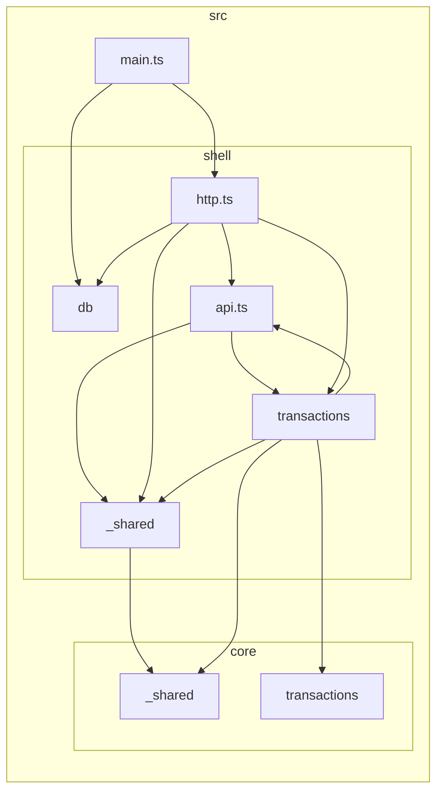

# Architecture

How fidy-ai is put together, and why. Companion documents: [`CONTEXT.md`](./CONTEXT.md) for the
ubiquitous language, [`CODING_STANDARDS.md`](./CODING_STANDARDS.md) for how code is written inside
this shape.

Rejected alternatives are recorded in [Decisions and what they rule out](#decisions-and-what-they-rule-out)
at the end. Read that before proposing a change — most obvious alternatives were considered and
turned down for reasons that are not visible in the code.

---

## 1. The shape

`src/` splits into two trees, each sliced by capability: **`core/`** holds pure business rules
typed `Effect<A, E, never>` and touches nothing outside itself; **`shell/`** holds every side
effect in the system. `src/main.ts` is the only place the program runs. Read the tree itself for
what is currently in it — `CODING_STANDARDS.md` gives the filename vocabulary a new slice follows.

**Why `http.ts` is separate from `api.ts`.** `HttpApiBuilder.group` takes the assembled `HttpApi` as
its first argument, so a slice's `handlers.ts` _must_ import `api.ts`. That is fine and acyclic —
`api.ts` imports slice **contracts**, handlers import `api.ts` — but it means `api.ts` can never
import handlers, so the layer wiring that composes them lives one file over. An earlier draft of
this document claimed "no slice imports `api.ts`"; that rule is impossible with Effect v4's HttpApi
and has been corrected.

This is layer-major rather than slice-major (`src/transactions/{core,repo,handlers}.ts`) on
purpose: it makes the purity boundary a **directory** rather than a filename convention. The lint
fence becomes `src/core/**`, and a file that is neither obviously core nor obviously shell cannot
exist. Most of this codebase is written by agent sessions that share no memory, so a structural
boundary survives where a naming convention would not.

The cost is real and accepted: **one feature touches two trees.** That is the same complaint that
sank the old `contracts/ | server/` layering. The difference is that this split encodes a property
we want enforced, rather than an arbitrary technical one.

A shell slice reaching into another slice's **core** is allowed and necessary — budgets are
computed from spend.

### The dependency graph

<!-- dependency-graph -->



<!-- /dependency-graph -->

---

## 2. What a slice is

> **A slice owns data. A process coordinates slices.**

- A process touching **one** slice's data lives **inside** that slice. Reconciliation is part of
  `transactions`, not a slice of its own.
- A process owning data nobody else owns **is** a slice, pipeline included. `ingestion` owns
  `NeedsReviewItem` and `IngestSample`.
- A process owning **no** data lives in **shell only**, with no `core/` folder. The WhatsApp
  adapter, the renewal cron.

And one rule that stops slices leaking: **a process never writes another slice's tables — it calls
that slice's operations**, so invariants and atomicity are enforced in one place. Ingestion creates
transactions by calling the transactions slice, not by reaching into its SQL.

Three cross-checks when drawing a boundary:

1. **Atomicity** — everything inside a slice commits together. If two things must be written in one
   transaction, they are one slice.
2. **Reference by id** — a slice never holds another slice's objects, only its ids. `Transaction`
   carries a `CategoryId`, never a `Category`.
3. **Invariant containment** — any rule that must hold at all times is enforceable inside one slice.
   An invariant spanning two slices means either the boundary is wrong, or the rule is eventual and
   should say so.

A slice is **not** a bounded context. fidy is one bounded context — one product, one vocabulary —
so there is a single `CONTEXT.md` and no context map. A slice is also not a use case:
`createTransaction` is an operation _in_ a slice.

### The thirteen slices

`identity` · `consent` · `transactions` (incl. `SourceAttestation` and reconciliation) ·
`categories` · `budgets` · `recurring` · `dashboard` · `insights` · `ingestion`
(`NeedsReviewItem`, `IngestSample`) · `tokens` · `audit` · `memory` (transcript, rolling summary,
`UserNote`) · `billing`.

Slices are lopsided in both directions and that is fine. `categories` is nearly all core.
**A slice with no real decisions gets no `rules.ts`** — an empty core file is ceremony.

**Three shell-only areas are not slices**, because they own no aggregate: `api` (the assembly, the
envelope, shared wire and authz concerns), `channels` (vendor adapters), and `agent` (the hosted
loop and its harness). They have no `core/` counterpart — but code lands in them, so they carry
commit scopes alongside the thirteen.

### Core slices do not import each other

A core slice may import shared **value types** from `core/_shared` — `UserId`, `CategoryId`, date
ranges. Where a decision needs data from two slices, the shell loads both and passes plain values
in:

```
decideAlerts({ budget, spentSoFar: Amount, alreadyFired, now })   // core/budgets never sees a Transaction
```

`Amount` is a value type of exactly that kind, and it still lives in `core/transactions/model.ts`
rather than in `core/_shared`, because transactions is the only slice that has one. It moves the
day a second slice needs it — the example above is what that day looks like.

**Core decides; it does not gather.** A core slice importing another slice's entity is implicitly
claiming it knows how to obtain it, which is shell's job. This also resolves the affordance
checkpoint — a pure function over `scope` and `tier` as plain arguments, so `core/_shared` depends
on no slice.

The cost is wider shell signatures, because assembling inputs is explicitly shell's work. That work
exists either way; this makes it visible instead of hiding it behind an import.

---

## 3. The functional core

Code under `src/core/` returns `Effect<A, E, never>`. The `never` is the fence: requesting any
service puts it in `R` and stops compiling — including services that do not exist yet. One
vocabulary (`Effect.gen`) on both sides of the boundary.

Time and randomness are **parameters**. Core takes `now: DateTime.Utc` and generated ids as
arguments; the shell supplies them.

`core/transactions/rules.ts` and `shell/transactions/handlers.ts` are the worked example: a
decision that takes `now` as a value, and the handler that reads the clock and hands it in.

### On purity, precisely

Effect **is** purely functional and immutable. An `Effect` value is a description; building one
executes nothing. `Effect.sync(() => Date.now())` is a pure value. Equally, a `Result`-returning
function can perform I/O in its body. **Neither type proves purity.**

The question was never which type is pure, but which fence a compiler and a linter can enforce.
`R = never` plus four banned constructors is that fence.

---

## 4. Model in core, contract in shell

The canonical schema for an entity lives in `core/<slice>/model.ts`. The `HttpApiGroup` that
exposes it — paths, status codes, required scope, cost class — lives in `shell/<slice>/contract.ts`
and references the core schemas.

This does not weaken contracts-once. The model is declared once, the operation is declared once, and
the server, typed client, OpenAPI spec, MCP tool definitions and agent toolkit all still derive from
that single operation declaration. Only _which tree_ each declaration sits in changed.

Keeping the whole contract in `core/` would have been defensible — building an `HttpApiEndpoint` is
pure. It was rejected because it puts URL paths and HTTP status codes inside the business rules,
which is the one thing having a core is meant to prevent.

**Derived variants, not parallel definitions.** Any shape differing from the canonical one is built
_from_ it — `mapFields`, `Struct.omit`/`pick`, or spreading `.fields`. Under two trees this stops
being a rule to remember: the canonical shape is by definition the one in `core/`, and everything in
`shell/` is built from it. This applies at the LLM boundary too — the strict extraction schema
(`amount, currency, merchant, date, account_hint, direction, channel`) is derived from
`core/transactions/model.ts`, not defined separately in `ingestion`.

A type that never mentions the schema it derives from is the smell to catch in review.

---

## 5. Ownership and isolation

`UserId` is the first argument of every repo function and of every core function that needs it.
There is no ambient `CurrentUser` service and no row-level security.

**Where the caller is resolved.** Effect v4's HttpApi middleware can only reach a handler by
`provides`-ing a service — which is exactly the ambient `CurrentUser` this section rejects. So the
caller is resolved by a plain function of the request, called on the handler's first line, and the
`UserId` travels onward as an explicit argument. Real bearer auth swaps that function's body
without touching a repo or a handler.

An explicit parameter can be present in the signature and absent from the SQL string, and types
cannot catch that. The guard is a **contract-derived isolation test**: seed two users, enumerate
every canonical operation from the `HttpApi` definition, call each as user B, assert nothing of user
A's is visible or mutable. Because the operation list is derived rather than hand-maintained, a new
operation that skips isolation fails a test nobody had to remember to write.

### Ownership is context, not a field

Ordinary aggregates — `Transaction`, `Budget`, `Category`, `RecurringSeries`, `DashboardDocument`,
`InsightEvent`, `NeedsReviewItem`, `Subscription` — carry **no** owner field. The user is the context
an operation runs in, established once at the door, not a field repeated on thirteen roots and
echoed back in every response.

**The exception** is records whose purpose is to attest who did something. `ConsentRecord` and
`AuditLogEntry` carry their subject explicitly. The test: _take one row out of its table and hand it
to a stranger — does it still mean something?_ "25,000 pesos at El Corral" is complete. "Somebody
consented to something" is not evidence, and a Ley 1581 artifact that cannot say who consented is
worthless.

Consequence accepted: `core/transactions/reconcile.ts` cannot verify two merge candidates belong to
the same user; it trusts the shell to have loaded one user's rows. Adding the field would make that
a runtime check, not a type error, and the isolation test covers the path that matters.

### Deferred: row-level security

RLS would make a forgotten `WHERE` return nothing rather than leak. Deferred because it requires a
policy in every migration and the app running as a non-owner role (table owners bypass RLS unless
`FORCE ROW LEVEL SECURITY` is set) — an operational wrinkle on Railway.

**Tripwire: revisit RLS if a non-request write path ever reads user data.** The isolation test covers
the API surface only; background jobs, the ingestion pipeline and the scheduler write without a
request. Retrofitting is a migration across every table plus a role change — real work, but not a
rewrite, because the `UserId` parameters are already threaded through.

---

## 6. Errors

Core failures are `Data.TaggedError` — they never leave the process, need no schema, carry no HTTP
vocabulary. Wire failures are `Schema.ErrorClass`, matching what
`effect/unstable/httpapi/HttpApiError.ts` uses for its own `BadRequest`/`Forbidden`/`NotFound`,
because they are encoded into a response body.

Between them sits **one exhaustive mapper per slice**, in `shell/<slice>/errors.ts`, switching on the
core error union's `_tag`. Not per handler (repetitive, and a missed tag falls through to a 500), and
not by giving core errors their own `code` field (that would put wire vocabulary inside `core/`).

**The cost of one mapper per slice, stated.** A shared mapper returns the union of every wire
failure the slice can produce, so each operation routing a domain failure must declare that whole
union — `createTransaction` advertises a 404 it can never return. TypeScript cannot narrow this: a
per-tag conditional return type does not verify inside the switch, and overloads on an arrow const
fail assignability. The only alternative is a mapper per handler, which this section rejects for
being forgettable.

That is a genuine wart on an API whose whole premise is legibility to an agent — a caller reading
the spec is told about failures that cannot happen. It is accepted for now because a silently
unmapped error is worse than an over-declared one, but it is worth revisiting if the noise grows.

Errors mirror the success envelope: correct status, a `code` from a closed set, a `message` written
to an agent — reason plus what to do, one or two sentences — and the same affordance list. Validation
failures carry field-level detail, never a raw parser dump. Paywall errors carry the upgrade
affordance; `scope_missing` carries none, because token changes happen in chat.

**`orDie` is for defects only.** A dead Postgres connection, yes. "Budget not found", no. This cannot
be linted — the `redundantOrDie` diagnostic means something else — so it is a review rule.

**Absence is an `Option`, not an error.** The repo cannot know whether a missing budget is a 404, an
upsert, or "no alerts for this category".

| query                    | helper                    | why                                                                                       |
| ------------------------ | ------------------------- | ----------------------------------------------------------------------------------------- |
| `SELECT … WHERE id = $1` | `SqlSchema.findOneOption` | absence is data; the handler decides                                                      |
| `INSERT … RETURNING`     | `SqlSchema.findOne`       | absence is impossible, so `NoSuchElementError` is a genuine defect and `orDie` is correct |

---

## 7. Migrations

Migrations live in `shell/db/migrations/`, one file per migration, globally and sequentially
numbered, composed into a `fromRecord` loader by an explicit index. **This is a deliberate exception
to slice locality**, noted so it does not read as an oversight: migrations are a single ordered
history of one database — the numbering is global, foreign keys cross slices, and the migrator
applies them as one sequence.

**The numbering is forced, not chosen.** `fromRecord` only accepts keys matching `^(\d+)_(.+)$`, and
the tracking table declares `migration_id` as `integer`. A `YYYYMMDDHHMMSS` timestamp is 14 digits
and overflows at 2,147,483,647, so timestamp prefixes — the usual answer to parallel branches — are
unavailable.

Two silent failure modes, neither caught by the migrator, the tests, or local development (locally
you always start from an empty database, where every migration runs):

1. **Migrations with an id ≤ the highest applied id are skipped without error** —
   `if (currentId <= latestMigrationId) continue`. Branch A takes `0007`, branch B takes `0008`, B
   deploys first, A's migration never runs and nothing complains. Exact duplicates _are_ caught; the
   near miss is the dangerous case.
2. **`fromRecord` silently drops keys that don't match the pattern** — a typo means a migration that
   never runs.

---

## 8. Testing

- **Core tests** prove the decision is right: every branch and boundary. No server, no database.
- **The API seam** proves the operation is wired up: the contract validates and rejects, rows persist
  and come back intact, the envelope and its affordances, per-user isolation.

The **agent seam** arrives with the agent slice — `AgentService.handleTurn` through the CLI-REPL
harness, with the model stubbed. It is a further seam, not a third tier: it will live under
`shell/` like every other shell test, so the two-tier split still decides where it runs.

A seam is where a test plugs in. An API-seam test traverses the decode gate, handlers, repo and
Postgres to reach a decision; a core test starts at the decision. **Neither fakes anything** — a core
function is a real public interface, not a stubbed collaborator.

**Core tests are not a loophole for testing the shell.** No mocked repos, no stubbed handlers.
Wanting to test `handlers.ts` in isolation means a decision belongs in core. The
load-decide-persist orchestration in `handlers.ts` gets no unit test of its own; it is covered at
the API seam.

**The API seam does not shrink.** What stops is using it as a unit-test harness for logic that has a
public interface four layers down.

The risk accepted: a well-tested core can still be wired up wrongly and core tests would not notice.
That is why every operation keeps its end-to-end coverage at the API seam.

### The mutation gate

Coverage says a line ran. **A mutation score says a test would have noticed had that line been
wrong**, which is the claim this section makes about core and the only one worth gating on. Stryker
rewrites `src/core` a mutant at a time and reruns `test:core` against each; a single survivor fails
`bun run test:mutation` and CI's Mutation job. The threshold is 100 — any number below it is a quota
of unnoticed defects, and quotas fill.

It runs through `bun --bun vitest`, on Stryker's command runner rather than its vitest runner, so
mutants are judged on the runtime that ships. Two mutators are excluded and one tier is out of
scope; both are recorded in the decisions table below, and `stryker.config.mjs` states the reasoning
in full.

**The shell was measured before being left out.** A trial run over `src/core` and `src/shell`
together plants 267 mutants, 65 of them outside the excluded mutators, and finds 8 survivors in
about three minutes. Four of those are worth a test and are not yet written; the other four cannot
be killed from any seam a test can reach:

- the `Body` branch of `ContractGateLive` — a failure to encode _our own_ response, which no request
  can provoke;
- the error-code vocabulary rendered into `detail`'s description, and the `error:` array on an
  operation's contract — both documentation, observable only as spec prose;
- the three migration bodies, which the migration log runs once per database, so every mutant after
  the dry run executes nothing at all.

Gating the shell would therefore mean either a threshold below 100 or four suppressions in source.
The core gate is kept honest instead, and the shell keeps the coverage and CRAP gates.

### Derived guards

Two tests enumerate from the contracts rather than a hand-kept list, so a new operation is covered
without anyone remembering:

1. **Isolation** — every canonical operation, called as another user, leaks nothing.
2. **Descriptions** — every canonical operation carries a non-empty OpenAPI description.

One more check — that a `next` entry only ever names an operation the generators actually expose —
is **not** derived. Two tests in `shell/transactions/handlers.test.ts` make it: one over the
success envelope `createTransaction` returns, one over the `not_found` failure `getTransaction`
returns, whose `next` is built in `shell/transactions/errors.ts`. Each sweeps a single operation's
affordances rather than all of them, so a new operation returning a bogus affordance would still
pass.

The condition for promoting this to a derived guard was a second operation proposing affordances.
That has happened: the guard is owed, and a third hand-written copy of the assertion is not it.

---

## Decisions and what they rule out

Most obvious alternatives here were considered and rejected. Read before reopening.

| decision                                 | rejected alternative                        | why                                                                                                                                                                                                                                                                                                                      |
| ---------------------------------------- | ------------------------------------------- | ------------------------------------------------------------------------------------------------------------------------------------------------------------------------------------------------------------------------------------------------------------------------------------------------------------------------ |
| Layer-major (`core/`, `shell/`)          | Slice-major (`transactions/{core,repo}.ts`) | Boundary becomes a directory, not a filename; a file cannot be "neither"                                                                                                                                                                                                                                                 |
| `Effect<A, E, never>` core               | Plain functions returning `Result<A, E>`    | Costs a second idiom and a lift at every call site; `R = never` plus four banned constructors is a comparable fence with one vocabulary                                                                                                                                                                                  |
| Model in core, contract in shell         | Whole contract in core                      | Puts URL paths and status codes inside business rules                                                                                                                                                                                                                                                                    |
| Model in core, contract in shell         | Separate domain model + wire DTO            | A mapping function per operation, and the thing OpenAPI/MCP derive from stops being the thing the domain uses                                                                                                                                                                                                            |
| Slice = owns data                        | Slice = API group                           | API groups are presentation and regroupable at no cost; a wrong aggregate boundary means a partial write                                                                                                                                                                                                                 |
| Core slices import only `_shared`        | Free cross-slice imports                    | Core would start gathering, which is shell's job                                                                                                                                                                                                                                                                         |
| Ownership as context                     | `userId` on every model                     | Contracts derive from models, so the field reaches the input schema unless stripped every time                                                                                                                                                                                                                           |
| Explicit `UserId` + derived test         | Ambient `CurrentUser` service               | Implicit, and unavailable to background jobs, which then pass the wrong user by hand                                                                                                                                                                                                                                     |
| Explicit `UserId` + derived test         | Row-level security                          | Deferred, not rejected — see the tripwire above                                                                                                                                                                                                                                                                          |
| One mapper per slice                     | `code` field on core errors                 | Wire vocabulary inside `core/`                                                                                                                                                                                                                                                                                           |
| One mapper per slice                     | `catchTags` per handler                     | Repetitive, and a missed tag silently becomes a 500                                                                                                                                                                                                                                                                      |
| Global migration log                     | Per-slice migrations                        | Ordering is global anyway; per-slice hides that                                                                                                                                                                                                                                                                          |
| Global migration log                     | Timestamp prefixes                          | Overflows the `integer` migration id column                                                                                                                                                                                                                                                                              |
| Mutation gate on `src/core` at 100       | Gating `src/core` and `src/shell` together  | Measured first (§8): four shell survivors are unkillable from any reachable seam — a response-encode branch, two documentation mutants, and migration bodies the migration log runs once per database. The choice was a sub-100 threshold or suppressions in source, and both make the number mean less than it says     |
| Mutation gate on `src/core` at 100       | 90, matching the coverage gates             | A coverage percentage measures how much code a suite touched, where the last 10% is genuinely dear; a mutation score counts defects nothing noticed, and a standing allowance for those is a different thing to buy                                                                                                      |
| Stryker's command runner                 | `@stryker-mutator/vitest-runner`            | The vitest runner drives vitest through its Node API, so every mutant would be judged on Node while the project ships on Bun. Per-test coverage analysis is the price, and at ~1s a core suite it buys nothing yet                                                                                                       |
| `StringLiteral`/`ObjectLiteral` excluded | Mutating them and suppressing per site      | In a declarative tree they almost always land in `annotate({ description: … })`; killing them needs either exact prose pinned in a test or assertions against Effect's AST internals. One documented exclusion in the config beats eleven `Stryker disable` comments in a repo that bans suppression directives outright |
| Core tests first-class                   | Core covered only through the API seam      | Core's branches are the model's schema checks — `Amount` alone rejects on three — and each boundary would need a full HTTP round-trip against a real database; `test:core` gates `src/core` at 90% lines with no database in the run, and CRAP ≤ 8 demands the coverage anyway, so this buys slower tests, not fewer     |

**This last row amends the Testing Decisions section of the spec (GitHub issue #1)**, which reads
"this is the exception, not a third seam". That was written before `core/` existed and now covers the
branchiest code in the project. The rule was aimed at tests that couple to internals and break on
refactor — a danger that does not apply to a pure function with a stable signature.
