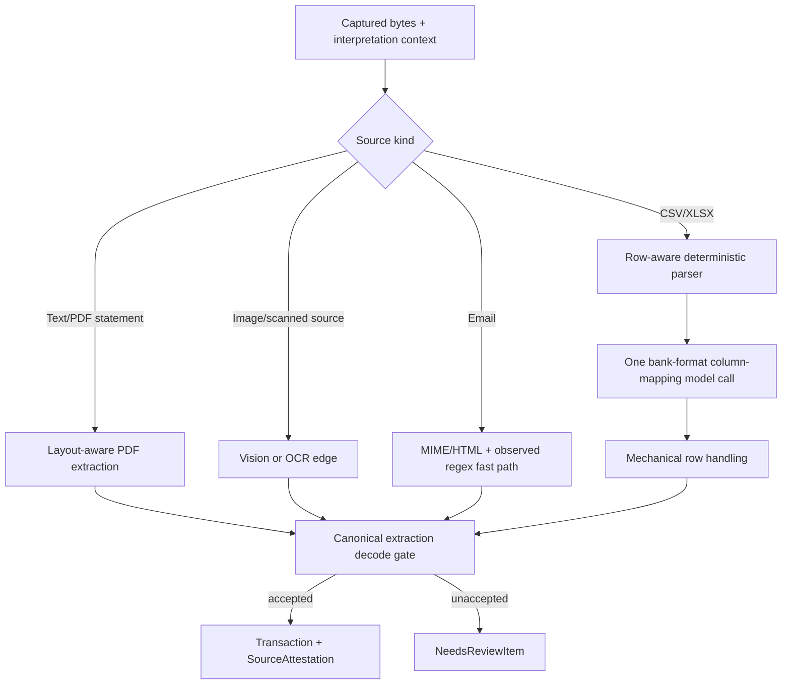

# anydoc for Fidy document ingestion

_Research snapshot: 2026-08-11. Evaluated against `firecrawl/anydoc` v0.1.8 at commit `4e3089b1ed43404241a303109f81e2c7933040b2` and Fidy issues #18–#22. Primary sources only._

## Executive verdict

**Do not replace Fidy's row-aware CSV/XLSX ingestion adapter with anydoc for issue #18.** anydoc is a fast, deterministic, local document-to-Markdown converter, but #18 needs a loss-accountable financial-row parser. Those are different contracts. anydoc deliberately tolerates partial conversion, can skip malformed CSV records and unreadable workbook sheets, and loses spreadsheet provenance and formatting that can matter when explaining a statement line. Those behaviors conflict with #18's requirement that every input row become either a Transaction or a NeedsReviewItem. [Fidy #18](https://github.com/B4rz99/fidy-ai/issues/18) · [anydoc conversion-error contract](https://github.com/firecrawl/anydoc/blob/4e3089b1ed43404241a303109f81e2c7933040b2/node/index.d.ts#L3-L20) · [CSV skip behavior](https://github.com/firecrawl/anydoc/blob/4e3089b1ed43404241a303109f81e2c7933040b2/src/formats/csv.rs#L18-L48) · [workbook partial-success behavior](https://github.com/firecrawl/anydoc/blob/4e3089b1ed43404241a303109f81e2c7933040b2/src/formats/sheet/mod.rs#L23-L44)

**anydoc can still be useful as an optional shell-edge utility or evaluation candidate**, especially for converting mixed, text-bearing office documents to LLM-ready Markdown. It should not become Fidy's universal Ingestion abstraction, canonical extraction shape, or evidence model.

**It does not eliminate model use.** For CSV/XLSX, no vision model is needed in Fidy's current design anyway: deterministic parsing produces rows, one small model call maps columns for a bank format, and rows are handled mechanically. anydoc could perform only the first, syntactic part; it cannot decide which columns mean occurred date, Money, direction, Counterparty, or Category. [Fidy parent specification, ingestion design](https://github.com/B4rz99/fidy-ai/issues/1) · [Fidy #18](https://github.com/B4rz99/fidy-ai/issues/18)

For future sources, anydoc can avoid vision only when the source already contains machine-readable text. Its local PDF path handles text-based PDFs, but scanned/image-only PDFs are unsupported and PDF has no structured `Document` result. Receipt photos and screenshots still require OCR/vision. [anydoc PDF feature](https://github.com/firecrawl/anydoc/blob/4e3089b1ed43404241a303109f81e2c7933040b2/README.md#L128-L137) · [PDF API limitation](https://github.com/firecrawl/anydoc/blob/4e3089b1ed43404241a303109f81e2c7933040b2/node/index.d.ts#L265-L293) · [Fidy #20](https://github.com/B4rz99/fidy-ai/issues/20) · [Fidy #21](https://github.com/B4rz99/fidy-ai/issues/21)

## What anydoc actually provides

### Verified capabilities

- It is an MIT-licensed Rust converter with Node, Python, and WASM bindings. It supports Word, PowerPoint, Excel, OpenDocument, RTF, EPUB, CSV, and PDF. [README and bindings](https://github.com/firecrawl/anydoc/blob/4e3089b1ed43404241a303109f81e2c7933040b2/README.md#L1-L13) · [supported formats](https://github.com/firecrawl/anydoc/blob/4e3089b1ed43404241a303109f81e2c7933040b2/README.md#L139-L150)
- Office formats parse into a shared `Document` model containing blocks, tables, notes, and assets; a common renderer converts that model to GitHub-Flavored Markdown. PDF bypasses that model and converts directly through `pdf-inspector`. [architecture](https://github.com/firecrawl/anydoc/blob/4e3089b1ed43404241a303109f81e2c7933040b2/README.md#L229-L247)
- The Node API can return either Markdown or the shared `Document`; its table model exposes a grid, header-row count, cell spans, and data/layout kind. [Node document API](https://github.com/firecrawl/anydoc/blob/4e3089b1ed43404241a303109f81e2c7933040b2/node/index.d.ts#L246-L293)
- The implementation is deterministic and local: no ML model or external service is used by the open-source library. [features](https://github.com/firecrawl/anydoc/blob/4e3089b1ed43404241a303109f81e2c7933040b2/README.md#L128-L137)
- CSV parsing supports comma, semicolon, tab, and pipe delimiter sniffing; UTF-8, BOM-marked UTF-16, and Windows-1252 decoding; quoted records; and ragged rows. [CSV parser](https://github.com/firecrawl/anydoc/blob/4e3089b1ed43404241a303109f81e2c7933040b2/src/formats/csv.rs#L1-L16) · [delimiter selection](https://github.com/firecrawl/anydoc/blob/4e3089b1ed43404241a303109f81e2c7933040b2/src/formats/csv.rs#L74-L110)
- Spreadsheet parsing is implemented with `calamine`; it supports multiple sheets, merged cells, strings, numbers, booleans, errors, dates, times, and durations, then converts every value to text in the shared table model. [dependencies](https://github.com/firecrawl/anydoc/blob/4e3089b1ed43404241a303109f81e2c7933040b2/Cargo.toml#L24-L33) · [sheet parser](https://github.com/firecrawl/anydoc/blob/4e3089b1ed43404241a303109f81e2c7933040b2/src/formats/sheet/mod.rs#L23-L116) · [cell conversion](https://github.com/firecrawl/anydoc/blob/4e3089b1ed43404241a303109f81e2c7933040b2/src/formats/sheet/mod.rs#L158-L192)

### What it does not provide

- It does not infer financial semantics or emit Fidy's canonical Transaction/Money-derived extraction shape.
- It does not provide SourceAttestations, NeedsReviewItems, row conservation, confidence, captured interpretation context, or parser revisioning.
- It does not preserve a general source-row identity. The current table API has only a relative grid; an open upstream issue demonstrates that a single-sheet workbook can lose both the sheet name and source range origin. [table API](https://github.com/firecrawl/anydoc/blob/4e3089b1ed43404241a303109f81e2c7933040b2/node/index.d.ts#L246-L263) · [anydoc #10](https://github.com/firecrawl/anydoc/issues/10)
- It is not OCR. Image-only PDFs are `unsupported`, and standalone receipt/screenshot image formats are not among its supported inputs. [error table](https://github.com/firecrawl/anydoc/blob/4e3089b1ed43404241a303109f81e2c7933040b2/README.md#L202-L227) · [supported formats](https://github.com/firecrawl/anydoc/blob/4e3089b1ed43404241a303109f81e2c7933040b2/README.md#L139-L150)
- It is not an email/MIME parser. Standalone HTML/MHTML support is currently an open feature request. [anydoc #52](https://github.com/firecrawl/anydoc/issues/52)

## Fit for issue #18: CSV/XLSX statement upload

### Where it aligns

anydoc is local, deterministic, fast, and broad in spreadsheet format support. Its `toDocument` table grid is a better starting point than reparsing generated Markdown, because Markdown introduces another lossy serialization step. If Fidy receives an unusual legacy spreadsheet variant that the selected row parser cannot read, an anydoc-backed fallback could potentially recover useful cells. This is a conclusion from the API shape, not a capability promised by Fidy today.

It also keeps model work out of mechanical row iteration. Fidy could still send only representative headers/sample rows to the column-mapping model and apply the returned mapping mechanically. That matches #18's intended split between deterministic parsing and one model call per bank format. [Fidy #18](https://github.com/B4rz99/fidy-ai/issues/18)

### Why it is not the right primary parser

1. **Its success contract is completeness-tolerant, not evidence-conserving.** The public API says conversion fails only when no meaningful Markdown can be produced and that producer quirks may be recovered or skipped. The CSV parser logs and skips unreadable records. The workbook parser skips unreadable sheets unless every sheet fails. Fidy instead requires every rejected statement row to survive as a NeedsReviewItem. [public error contract](https://github.com/firecrawl/anydoc/blob/4e3089b1ed43404241a303109f81e2c7933040b2/node/index.d.ts#L3-L20) · [CSV records](https://github.com/firecrawl/anydoc/blob/4e3089b1ed43404241a303109f81e2c7933040b2/src/formats/csv.rs#L28-L40) · [sheets](https://github.com/firecrawl/anydoc/blob/4e3089b1ed43404241a303109f81e2c7933040b2/src/formats/sheet/mod.rs#L31-L44) · [Fidy #18](https://github.com/B4rz99/fidy-ai/issues/18)
2. **It discards provenance needed for statement-line evidence.** The table grid does not carry source coordinates, and single-sheet identity can disappear. Fidy needs original evidence and an immutable statement-line SourceAttestation for each accepted row. [anydoc #10](https://github.com/firecrawl/anydoc/issues/10) · [Fidy #18](https://github.com/B4rz99/fidy-ai/issues/18)
3. **It normalizes spreadsheets for reading, not for exact financial capture.** It converts cells to strings, rounds floating spreadsheet values to 15 significant digits, and currently ignores number-format metadata. The open number-format issue shows that a displayed `7.5%` becomes `0.075` and a displayed currency value loses its currency format. Fidy's canonical gate would still reject malformed Money, but omitted formatting can remove evidence useful for identifying Currency or interpreting a column. [cell conversion](https://github.com/firecrawl/anydoc/blob/4e3089b1ed43404241a303109f81e2c7933040b2/src/formats/sheet/mod.rs#L158-L192) · [anydoc #27](https://github.com/firecrawl/anydoc/issues/27)
4. **It makes visibility choices without retaining visibility metadata.** An open issue demonstrates hidden rows and columns being returned as ordinary visible cells. A financial statement adapter should make that policy explicitly and preserve enough evidence to explain it. [anydoc #9](https://github.com/firecrawl/anydoc/issues/9)
5. **Its table cleanup can erase empty trailing rows.** The shared grid builder drops trailing all-empty rows. That is reasonable for clean Markdown, but it is another sign that the model's invariant is readable document structure rather than byte/record accounting. [grid cleanup](https://github.com/firecrawl/anydoc/blob/4e3089b1ed43404241a303109f81e2c7933040b2/src/model/table.rs#L245-L268)
6. **Production runtime fit is not yet proven.** The published native package declares Node `>=20` and prebuilt N-API targets, while Fidy runs and bundles for Bun. A local smoke test on 2026-08-11 successfully imported `@firecrawl/anydoc` v0.1.8 and parsed CSV bytes under Bun 1.3.14 on macOS arm64. That removes the basic loading concern but does not prove Fidy's production bundle, Linux container target, memory behavior, or teardown. Upstream does not declare Bun support. [Node package metadata](https://github.com/firecrawl/anydoc/blob/4e3089b1ed43404241a303109f81e2c7933040b2/node/package.json#L25-L59) · [Fidy `package.json`](../../package.json)

### Recommendation for #18

Keep a narrow, row-aware source adapter whose output makes accounting explicit, for example:

```text
ParsedStatement
  format
  sheets[]
    sheetName
    rows[]
      sourceRow
      cells[]
        rawText
        displayedText (when available)
        typedValue (when useful)
      parseOutcome = parsed | unreadable
```

The exact shape should derive where it differs from canonical schemas and should remain a shell concern, but it must preserve enough evidence to enforce:

```text
statement data-row count
  = accepted Transactions
  + NeedsReviewItems
```

Run the one column-mapping model call over headers plus bounded representative rows, then apply its mapping mechanically. Each mapped row must still pass the canonical Money/Transaction decode gate. A parser error becomes a NeedsReviewItem rather than a skipped row. This is the architecture already described by #18 and the parent specification. [Fidy #18](https://github.com/B4rz99/fidy-ai/issues/18) · [Fidy parent specification](https://github.com/B4rz99/fidy-ai/issues/1)

If anydoc is evaluated anyway, use `toDocument`, never Markdown, and require a fixture spike to prove row conservation, sheet/row evidence, displayed/raw monetary values, hidden-row policy, malformed-record handling, Bun loading, memory limits, and behavior on real anonymized Colombian statement formats. Adoption should be based on those fixtures, not the library's document-quality benchmark, whose target is readable Markdown rather than financial-row fidelity. [benchmark methodology](https://github.com/firecrawl/anydoc/blob/4e3089b1ed43404241a303109f81e2c7933040b2/README.md#L152-L188)

## Fit for adjacent Fidy ingestion issues

| Fidy source                                                                         | anydoc fit                                                                                                                                              | Recommendation                                                                                                                                                                                          |
| ----------------------------------------------------------------------------------- | ------------------------------------------------------------------------------------------------------------------------------------------------------- | ------------------------------------------------------------------------------------------------------------------------------------------------------------------------------------------------------- |
| CSV/XLSX statements ([#18](https://github.com/B4rz99/fidy-ai/issues/18))            | **Partial syntactic fit; poor primary-contract fit.** Deterministic cells, but partial-success and provenance loss conflict with row conservation.      | Keep a dedicated row parser. Optionally benchmark `toDocument` as a fallback against real fixtures.                                                                                                     |
| PDF statements ([#20](https://github.com/B4rz99/fidy-ai/issues/20))                 | **Partial.** Local extraction works only for text-based PDFs; PDF returns Markdown rather than the structured document model, and image-only PDFs fail. | A native-text fast path may be worth a separate prototype, but retain layout-aware model fallback and the same canonical gate/NeedsReview path. Decrypt protected PDFs first in memory as #20 requires. |
| Receipt photos and screenshots ([#21](https://github.com/B4rz99/fidy-ai/issues/21)) | **No fit.** Images are not supported document inputs and there is no OCR.                                                                               | Keep vision/OCR at a narrow shell edge. Canonical validation and NeedsReview remain mandatory.                                                                                                          |
| Forwarded notification emails ([#22](https://github.com/B4rz99/fidy-ai/issues/22))  | **No direct fit.** It is not MIME or standalone HTML parsing infrastructure.                                                                            | Use an email/MIME adapter, observed regexes, and model fallback as specified.                                                                                                                           |
| General office-document-to-context use                                              | **Good fit.** Broad deterministic conversion and one shared model/Markdown renderer are exactly its stated purpose.                                     | Consider only if Fidy later adds such an Ingestion source; do not widen the current domain in anticipation.                                                                                             |

## Could hosted Firecrawl Parse replace vision?

Firecrawl's hosted `/parse` is a separate proposition from open-source anydoc. It accepts uploads and can return Markdown or schema-shaped JSON. For PDFs it offers `fast`, `auto`, and `ocr`: `auto` starts with native text and falls back to OCR; `ocr` processes every page. Structured JSON is an LLM extraction format, so it does not remove model dependence; it moves it behind Firecrawl's API. [official Parse documentation](https://docs.firecrawl.dev/features/parse) · [official Parse API schema](https://docs.firecrawl.dev/api-reference/endpoint/parse)

For Fidy, hosted Parse should **not** be added merely to avoid OpenAI vision:

- it becomes another external processor receiving financial documents;
- zero-data-retention is off by default and must be enabled through Firecrawl rather than assumed;
- OCR quality still varies with scans;
- its schema output would still need derivation from and decoding through Fidy's canonical schemas;
- failures and partial output would still need Fidy's NeedsReview semantics; and
- it would add a provider seam that the current MVP does not require.

The first two points are documented in the official Parse API (`zeroDataRetention` defaults to `false` and requires contacting Firecrawl); the remaining points are conclusions from Fidy's canonical-operation and Ingestion requirements. [Parse API](https://docs.firecrawl.dev/api-reference/endpoint/parse) · [Fidy architecture](../../ARCHITECTURE.md) · [Fidy #18](https://github.com/B4rz99/fidy-ai/issues/18)

A future provider evaluation could compare Firecrawl Parse's OCR-only Markdown against OpenAI native PDF/image input using Fidy's anonymized IngestSamples, measuring Transaction field accuracy, table-row conservation, latency, cost, Colombia data-processing terms, ZDR availability, and failure behavior. Until that evidence exists, switching providers is not justified.

## Recommended architecture

Use source-specific deterministic extraction before model interpretation where the bytes actually contain structure; do not force all sources through one document converter.



anydoc could sit behind a narrow optional `office document -> Document/Markdown` adapter, but it should not define the Ingestion pipeline. Fidy's deep contract remains: preserve captured context and evidence, decode through canonical schemas, and turn every unaccepted unit into a NeedsReviewItem.

## Decision

1. **#18:** do not add anydoc as the primary CSV/XLSX parser.
2. **Before #20:** optionally run a small text-PDF prototype against anonymized Colombian statements to see whether a deterministic fast path reduces model input without losing table rows. Compare `pdf-inspector` directly as well, because anydoc's PDF API only returns one Markdown blob and an open issue requests page-aware output. [anydoc #62](https://github.com/firecrawl/anydoc/issues/62)
3. **#21:** retain vision/OCR; anydoc cannot help.
4. **#22:** retain MIME/regex/model architecture; anydoc cannot parse the source envelope.
5. **Future mixed office documents:** reconsider anydoc when that source exists, behind a shell service and fixture-backed acceptance tests.

## Unresolved questions

- What exact CSV/XLSX bank statement fixtures and malformed-row cases will define #18's “input line count” (all physical records, all parsed records, or all identified data rows)? The issue requires conservation but does not yet define headers, footers, and blank rows precisely.
- Does `@firecrawl/anydoc` v0.1.8 bundle and run reliably under Fidy's Linux production image, including memory limits and teardown? A local Bun/macOS import-and-parse smoke test passed, but upstream declares Node rather than Bun.
- For #20, do representative Colombian statement PDFs preserve transaction-table rows better through OpenAI native layout-aware input, `pdf-inspector` page output, or anydoc's combined Markdown?
- What data-processing terms and ZDR availability would Firecrawl offer for Colombian financial documents? Public API docs describe the feature toggle but do not answer Fidy's legal/provider due diligence.
