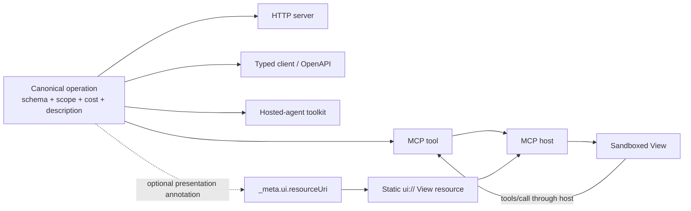
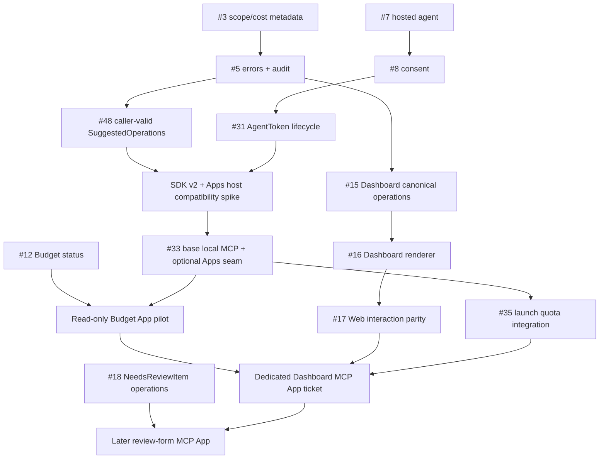

# MCP 2026-07-28 and Fidy's future MCP

_Research snapshot: 2026-07-28. Primary sources only: official MCP blog, specification, documentation and repositories; Fidy's repository documents and GitHub issues read through `gh`._

## Executive verdict

**Recommendation:** target the MCP `2026-07-28` core for Fidy's future server, while recognizing that its largest operational benefit—stateless, independently routable HTTP requests—belongs to a later remote MCP that the MVP explicitly excludes. For the planned local stdio server, the immediate gains are a current protocol baseline, per-request capabilities, explicit discovery, deterministic private tool catalogs and clean restart behavior rather than a new product capability.

Adopt MCP Apps as an **optional presentation derived from Fidy's canonical operations**, not as a second API, a source of domain state, or a prerequisite for the first local MCP server. It can make Fidy unusually useful inside a User's own agent: a canonical operation can still return agent-legible text and structured data while a supporting host renders the same result as an interactive Budget view, Transaction explorer, DashboardDocument, or NeedsReviewItem form.

Change ticket planning now, but defer production Apps UI code until two conditions hold:

1. the base local MCP server and its scope, SuggestedOperation, AuditLogEntry and quota paths are complete; and
2. the official MCP Apps package is demonstrably compatible with the MCP `2026-07-28` TypeScript SDK and the exact local-stdio hosts Fidy intends to support.

The linked article is primarily the release announcement for the stateless MCP `2026-07-28` core, not the first announcement of MCP Apps. It says the release formalizes an extensions framework in which MCP Apps participates; MCP Apps itself became a stable official extension on 2026-01-26. [Official `2026-07-28` release source](https://github.com/modelcontextprotocol/modelcontextprotocol/blob/add218af97224816f23e7005864b39f94371a37b/blog/content/posts/2026-07-28-spec-ga/index.md#L20-L45) · [official MCP Apps launch post](https://blog.modelcontextprotocol.io/posts/2026-01-26-mcp-apps/) · [stable Apps specification status](https://github.com/modelcontextprotocol/ext-apps/blob/92f46a574568a3ddac7600343b7d3c4c4ed7b588/specification/2026-01-26/apps.mdx#L1-L53)

## 1. What the announced capability is

### Verified facts

MCP `2026-07-28` removes the core `initialize`/`initialized` handshake and protocol sessions. Every request instead carries protocol version, client identity and client capabilities in `_meta`; `server/discover` is available for up-front discovery. It also adds cache hints, deterministic list ordering, HTTP method/name headers, authorization hardening and a formal extensions framework. [Official release details](https://github.com/modelcontextprotocol/modelcontextprotocol/blob/add218af97224816f23e7005864b39f94371a37b/blog/content/posts/2026-07-28-spec-ga/index.md#L29-L89)

MCP Apps is the official optional extension identified by `io.modelcontextprotocol/ui`. It lets an MCP tool point through `_meta.ui.resourceUri` to a predeclared `ui://` resource containing `text/html;profile=mcp-app`; a supporting host fetches the resource, renders it in a sandboxed iframe and exchanges JSON-RPC with it over `postMessage`. [Official extension definition](https://github.com/modelcontextprotocol/ext-apps/blob/92f46a574568a3ddac7600343b7d3c4c4ed7b588/specification/2026-01-26/apps.mdx#L36-L53) · [resource and rendering requirements](https://github.com/modelcontextprotocol/ext-apps/blob/92f46a574568a3ddac7600343b7d3c4c4ed7b588/specification/2026-01-26/apps.mdx#L55-L286) · [view transport](https://github.com/modelcontextprotocol/ext-apps/blob/92f46a574568a3ddac7600343b7d3c4c4ed7b588/specification/2026-01-26/apps.mdx#L411-L508)

A View can receive the initiating tool's input and result, call tools back through the host, request resources, send a chat message, and explicitly update model context. The specification recommends putting UI data in `structuredContent`, which is not automatically added to model context, while retaining meaningful `content` for the model and text-only clients. [Official data-passing rules](https://github.com/modelcontextprotocol/ext-apps/blob/92f46a574568a3ddac7600343b7d3c4c4ed7b588/specification/2026-01-26/apps.mdx#L1391-L1490) · [official core tool-result rules](https://modelcontextprotocol.io/specification/2026-07-28/server/tools#structured-content)

MCP Apps therefore standardizes an in-conversation UI resource and its host bridge. It does **not** standardize Fidy's domain model, replace an MCP server transport, supply authorization, guarantee that every MCP host renders Apps, or make a local MCP server remotely reachable. Extensions are optional, disabled by default, independently versioned, and not required for core MCP conformance. [Official extensions lifecycle and SDK rules](https://github.com/modelcontextprotocol/modelcontextprotocol/blob/add218af97224816f23e7005864b39f94371a37b/docs/extensions/overview.mdx#L76-L116)

### Why this is useful to Fidy

**Recommendation:** use Apps where direct manipulation or dense financial information is materially better than another prompt:

1. **First pilot — Budget status:** render one canonical Budget-status result as separate same-Currency groups, with the explicit applied IANA time zone. This is read-only, deterministic, free-tier-compatible and already bounded to one operation by [issue #12](https://github.com/B4rz99/fidy-ai/issues/12).
2. **Highest-value destination — DashboardDocument:** render the same recursive split tree and widgets planned for the web dashboard. Gestures should emit the same canonical `DashboardEdit` vocabulary as the web UI; no MCP-specific edit model. This builds directly on [#15](https://github.com/B4rz99/fidy-ai/issues/15), [#16](https://github.com/B4rz99/fidy-ai/issues/16) and [#17](https://github.com/B4rz99/fidy-ai/issues/17).
3. **Later workflow — NeedsReviewItem resolution:** a form can show unresolved statement rows and invoke the canonical resolution operation. This is a strong Apps use case, but it is a sensitive `write`/possibly `expensive` path and should follow [#18](https://github.com/B4rz99/fidy-ai/issues/18), scope enforcement, audit and quota work.
4. **Later exploration — Transactions:** filter and inspect Transactions without repeated prompts. Keep Money grouped by Currency and never create a mixed-Currency total.

Do **not** use an MCP App for token minting or consent. Fidy's in-chat disclosure, confirmation, ConsentRecord and one-time link in [#31](https://github.com/B4rz99/fidy-ai/issues/31) are the authoritative flow; putting an AgentToken in View HTML, tool results or model context would undo that design.

## 2. Compatibility, clients and negotiation

### Verified facts

MCP Apps is optional and must be negotiated. Under the `2026-07-28` extension framework, clients send `io.modelcontextprotocol/ui` and supported MIME types in per-request client capabilities, while servers advertise extensions through `server/discover`. A server must gracefully fall back to core behavior when a client lacks UI support unless the extension is mandatory; the Apps specification specifically requires meaningful text content even when UI is available. [Official extension negotiation](https://github.com/modelcontextprotocol/modelcontextprotocol/blob/add218af97224816f23e7005864b39f94371a37b/docs/extensions/overview.mdx#L114-L185) · [Apps fallback requirements](https://github.com/modelcontextprotocol/ext-apps/blob/92f46a574568a3ddac7600343b7d3c4c4ed7b588/specification/2026-01-26/apps.mdx#L1529-L1559)

The official MCP matrix currently marks Apps support for Claude web/Desktop, VS Code GitHub Copilot, Microsoft 365 Copilot, Goose, Postman, MCPJam, ChatGPT, Cursor, Archestra.AI and PostHog Code, but the same page explicitly says the matrix is community-maintained. This is evidence of ecosystem reach, not a substitute for testing Fidy against chosen hosts. [Official matrix and caveat](https://github.com/modelcontextprotocol/modelcontextprotocol/blob/add218af97224816f23e7005864b39f94371a37b/docs/extensions/client-matrix.mdx#L16-L46)

A host must support **both** the Fidy server's transport and MCP Apps. Apps support in a web host does not imply that the host can launch Fidy's local stdio process; the official build guide, for example, instructs local development against Claude web to expose an HTTP server through a tunnel. [Official Apps build/test guide](https://modelcontextprotocol.io/extensions/apps/build#testing-your-app)

There is a release-time compatibility uncertainty. The current stable Apps spec is version `2026-01-26` and its client/server negotiation example still uses core `initialize`, while the July core removed that handshake. The current `@modelcontextprotocol/ext-apps` package is `1.7.5` and peers on `@modelcontextprotocol/sdk ^1.29.0`; the new TypeScript SDK calls its `main` line v2, uses new `@modelcontextprotocol/server` and `@modelcontextprotocol/client` packages, and says v2 implements `2026-07-28`. These primary sources do not yet prove that the Apps server helpers plug into SDK v2 without an adapter. [Stable Apps negotiation text](https://github.com/modelcontextprotocol/ext-apps/blob/92f46a574568a3ddac7600343b7d3c4c4ed7b588/specification/2026-01-26/apps.mdx#L1492-L1559) · [Apps package peer dependency](https://github.com/modelcontextprotocol/ext-apps/blob/92f46a574568a3ddac7600343b7d3c4c4ed7b588/package.json#L78-L114) · [TypeScript SDK v2 status](https://github.com/modelcontextprotocol/typescript-sdk/blob/cc4b41617ce3601b1290d67216ea0b194a3cd9ac/README.md#L4-L15)

Fidy has an additional implementation gap: the source-of-truth Effect implementation currently exposes only an MCP `2025-06-18` protocol adapter, and its `ProtocolVersion` type contains only that revision. Fidy therefore cannot use Effect's `McpServer` unchanged while claiming `2026-07-28` conformance. [Effect MCP protocol implementation](https://github.com/Effect-TS/effect/blob/5002d95d83325533ab15dc29a853727eae804ae1/packages/effect/src/unstable/ai/McpProtocol.ts#L10-L44)

### Recommendations

- Do not claim “Apps work in any MCP client.” Claim: **all compatible clients get canonical tools and meaningful text; Apps-capable hosts may render the richer View.**
- Before selecting dependencies for #33, run a small compatibility spike against the exact versions of Effect's MCP implementation, the official TypeScript v2 SDK, `ext-apps`, Claude Desktop and one second local-stdio host. Decide explicitly whether to wait for/contribute Effect support or use the official SDK as a thin shell adapter; in either case, canonical operation schemas must remain derived rather than hand-written. Record the protocol/host matrix and decision in #33.
- Target `2026-07-28` for new Fidy code because Fidy is unreleased, but do not implement legacy compatibility merely on speculation. Add it only if an intended launch host demonstrably requires it.
- Treat host context such as locale and time zone as presentation hints only. User identity, ServiceMarket, applied IANA time zone and historical interpretation must continue to come from Fidy's canonical operation and persisted context, never from the host.

## 3. Transport and authorization constraints

### Local stdio — relevant now

The `2026-07-28` stdio transport still consists of a host-launched subprocess exchanging newline-delimited JSON-RPC over stdin/stdout; protocol version and capabilities travel in each message body, with no HTTP header layer. [Official stdio binding](https://github.com/modelcontextprotocol/modelcontextprotocol/blob/add218af97224816f23e7005864b39f94371a37b/docs/specification/2026-07-28/basic/transports/stdio.mdx#L7-L31) · [stdio request metadata](https://github.com/modelcontextprotocol/modelcontextprotocol/blob/add218af97224816f23e7005864b39f94371a37b/docs/specification/2026-07-28/basic/transports/stdio.mdx#L65-L72)

The MCP authorization specification applies to HTTP transports and says stdio implementations should retrieve credentials from the environment rather than run that OAuth flow. This supports #33's local process reading the User's AgentToken from configuration; MCP Apps does not change it. [Official authorization scope](https://github.com/modelcontextprotocol/modelcontextprotocol/blob/add218af97224816f23e7005864b39f94371a37b/docs/specification/2026-07-28/basic/authorization/index.mdx#L10-L24) · [Fidy issue #33](https://github.com/B4rz99/fidy-ai/issues/33)

The App's `postMessage` channel is a separate View-to-host transport. The View should ask the host to call a Fidy MCP tool; it should not open Fidy's config, receive the AgentToken, or call Fidy's HTTP API directly. The host then proxies the call over its existing stdio connection. [Official Apps communication and proxy model](https://github.com/modelcontextprotocol/ext-apps/blob/92f46a574568a3ddac7600343b7d3c4c4ed7b588/specification/2026-01-26/apps.mdx#L411-L508)

### Remote Streamable HTTP — later only

The July stateless core would help a future hosted MCP endpoint scale and route requests without transport sessions, but Fidy's parent specification explicitly leaves hosted/remote MCP and its OAuth server out of scope. That remains the right boundary; Apps does not justify changing it. [Official stateless release rationale](https://github.com/modelcontextprotocol/modelcontextprotocol/blob/add218af97224816f23e7005864b39f94371a37b/blog/content/posts/2026-07-28-spec-ga/index.md#L20-L45) · [Fidy parent issue #1](https://github.com/B4rz99/fidy-ai/issues/1)

If remote MCP is later approved, Streamable HTTP requires one POST endpoint, `Origin` validation, authentication, and `MCP-Protocol-Version`/`Mcp-Method`/`Mcp-Name` request metadata; the core authorization flow uses OAuth 2.1 discovery and now prefers Client ID Metadata Documents over deprecated Dynamic Client Registration. [Official Streamable HTTP security requirements](https://github.com/modelcontextprotocol/modelcontextprotocol/blob/add218af97224816f23e7005864b39f94371a37b/docs/specification/2026-07-28/basic/transports/streamable-http.mdx#L27-L68) · [official authorization specification](https://modelcontextprotocol.io/specification/2026-07-28/basic/authorization) · [official July authorization changes](https://github.com/modelcontextprotocol/modelcontextprotocol/blob/add218af97224816f23e7005864b39f94371a37b/blog/content/posts/2026-07-28-spec-ga/index.md#L74-L81)

## 4. Security and data constraints

### Verified facts

The Apps threat model includes malicious HTML, sandbox escape, unauthorized tool execution, data exfiltration, phishing/social engineering and resource exhaustion. Required mitigations include sandboxed iframes, validated/loggable JSON-RPC and host-enforced CSP; a host must block undeclared domains, while social engineering and CPU/memory consumption remain residual risks. [Official Apps security section](https://github.com/modelcontextprotocol/ext-apps/blob/92f46a574568a3ddac7600343b7d3c4c4ed7b588/specification/2026-01-26/apps.mdx#L1680-L1763)

If a UI resource omits CSP metadata, the host must apply a restrictive default with no external connections; hosts may restrict further but may not permit undeclared origins. Camera, microphone, geolocation and clipboard-write are optional requested permissions, not guarantees. [Official CSP and permission rules](https://github.com/modelcontextprotocol/ext-apps/blob/92f46a574568a3ddac7600343b7d3c4c4ed7b588/specification/2026-01-26/apps.mdx#L99-L286)

`_meta.ui.visibility` distinguishes whether a tool is exposed to the model and/or callable from the App. It is not an authorization system: the core tools specification separately requires server access control and explicitly permits `tools/list` to vary by per-request authorization. [Official Apps visibility semantics](https://github.com/modelcontextprotocol/ext-apps/blob/92f46a574568a3ddac7600343b7d3c4c4ed7b588/specification/2026-01-26/apps.mdx#L319-L404) · [official core tool capability rules](https://modelcontextprotocol.io/specification/2026-07-28/server/tools#capabilities) · [official tool security requirements](https://modelcontextprotocol.io/specification/2026-07-28/server/tools#security-considerations)

The July core requires cache hints on `tools/list` and `resources/read`. A `private` cache scope may only be reused in the same authorization context; a `public` scope may be shared across callers. [Official MCP caching specification](https://modelcontextprotocol.io/specification/2026-07-28/server/utilities/caching#cache-scope-field)

### Recommendations for financial data

- Bundle the View's HTML, JavaScript and CSS into the `ui://` resource. Request no browser permissions and no external network origins for the first Fidy App.
- Keep the resource static and free of User data so it can be reviewed and safely cached. Send current data only in the canonical tool result; do not bake Transaction, Budget, User or AgentToken values into HTML.
- Mark scope-filtered `tools/list` results `cacheScope: "private"` and return them in deterministic order. A static identical UI resource may be `public`; any User-dependent resource must be `private`.
- Put the canonical `{ data, next }` shape in MCP `structuredContent` and keep a concise, meaningful `content` fallback. Do not create a parallel “widget DTO”; any display projection must derive from the canonical schema.
- Do not call `ui/update-model-context` with raw Transaction history. Send only the minimal User-selected summary needed for the conversation, and let the User's explicit action determine when that happens.
- Re-authorize every View-initiated canonical call from the current AgentToken. `_meta.ui.visibility` may narrow exposure but never grant `read`, `write` or `dashboard`.
- Prefer `visibility: ["model", "app"]` for Fidy domain capabilities. An app-only domain operation would violate the define-once/dogfooding rule. If a purely presentational helper is ever needed, it must not own business decisions or bypass canonical operations.
- Persist DashboardDocument, NeedsReviewItem and other state on the server. The stable Apps specification explicitly leaves state persistence/restoration to future work, so iframe state cannot be authoritative. [Deferred Apps features](https://github.com/modelcontextprotocol/ext-apps/blob/92f46a574568a3ddac7600343b7d3c4c4ed7b588/specification/2026-01-26/apps.mdx#L1562-L1576)

## 5. Fit with Fidy's define-once architecture

Fidy defines a canonical operation once in the shell over core schemas, then derives server, typed client, OpenAPI, MCP tools and hosted-agent toolkit; differing shapes must derive from the canonical model rather than become parallel definitions. [Fidy architecture §4](https://github.com/B4rz99/fidy-ai/blob/f41fb4772692bdbc0154879ff305c391cd9ad03d/ARCHITECTURE.md#4-model-in-core-operation-definition-in-shell) · [parent specification #1](https://github.com/B4rz99/fidy-ai/issues/1)

**Recommendation:** add one optional **MCP App presentation annotation** to selected shell operation definitions. The MCP generator reads it to add `_meta.ui.resourceUri`; a resource registry maps that URI to a static View bundle. Input, output, failures, required scope, cost class and operation identity still come only from the canonical operation.

The View is therefore another editor/presenter at a shell boundary, analogous to the SPA—not another slice and not another bounded context. The relevant invariants remain:

- a User click and an agent call invoke the same canonical operation;
- `UserId` is resolved at the door and never inferred from host context;
- Money remains nested and exact, with separate Currency groups;
- SuggestedOperations retain canonical operation identity and caller-valid filtering;
- every call, including a View-initiated call, produces the same metadata-only AuditLogEntry;
- the View contains presentation logic, not domain decisions.

## 6. GitHub issue findings and concrete changes

### Tracker snapshot

The direct MCP search found [#1](https://github.com/B4rz99/fidy-ai/issues/1), [#33](https://github.com/B4rz99/fidy-ai/issues/33) and the closed documentation issue [#46](https://github.com/B4rz99/fidy-ai/issues/46). The dependency and acceptance-criteria review also makes [#3](https://github.com/B4rz99/fidy-ai/issues/3), [#5](https://github.com/B4rz99/fidy-ai/issues/5), [#12](https://github.com/B4rz99/fidy-ai/issues/12), [#15](https://github.com/B4rz99/fidy-ai/issues/15), [#16](https://github.com/B4rz99/fidy-ai/issues/16), [#17](https://github.com/B4rz99/fidy-ai/issues/17), [#18](https://github.com/B4rz99/fidy-ai/issues/18), [#25](https://github.com/B4rz99/fidy-ai/issues/25), [#31](https://github.com/B4rz99/fidy-ai/issues/31), [#35](https://github.com/B4rz99/fidy-ai/issues/35) and [#48](https://github.com/B4rz99/fidy-ai/issues/48) relevant.

All reviewed open issues carry `ready-for-agent` and have no comments. #46 is closed; its sole comment records delivery and the rename of the API test harness. [#46 and close comment](https://github.com/B4rz99/fidy-ai/issues/46#issuecomment-5109961502)

### #1 — parent MVP specification

**Verified:** #1 is open and requires the server, typed client, OpenAPI, MCP definitions and hosted-agent toolkit to derive from one canonical operation declaration. It commits to local MCP and puts hosted/remote MCP out of scope. [Issue #1](https://github.com/B4rz99/fidy-ai/issues/1)

**Recommendation:** add this planning sentence, without changing launch scope:

> MCP Apps is an optional derived presentation for selected canonical operations. It introduces no private domain operations, no parallel response model and no remote MCP endpoint; clients without `io.modelcontextprotocol/ui` receive meaningful core MCP content.

### #33 — Local MCP server

**Verified:** #33 is open, labeled `ready-for-agent`, has no comments, and is blocked only by #31. Its acceptance criteria require scope-filtered tool listing, canonical responses and errors, setup documentation, and zero MCP-specific work when an operation is added. [Issue #33](https://github.com/B4rz99/fidy-ai/issues/33)

**Concrete implications:** this is the main ticket affected. “Claude or any MCP client works” remains valid only for core tools; inline UI requires a host that also supports Apps. Its current blocker list also omits the issues that supply scope metadata, machine-actionable responses and the caller-valid SuggestedOperation invariant.

**Recommendation — preserve the four existing criteria and add/reword these:**

- [ ] Core MCP targets `2026-07-28`; an explicit tested host/version matrix records local-stdio and `io.modelcontextprotocol/ui` support. No untested “any client renders Apps” claim.
- [ ] The transport dependency decision accounts for Effect's current `2025-06-18`-only adapter and proves `2026-07-28` wire compatibility without introducing parallel operation definitions.
- [ ] `tools/list` is deterministic, `cacheScope: "private"`, and contains exactly the canonical operations allowed by the AgentToken's scopes; cache entries never cross authorization contexts.
- [ ] Tool name, description, input schema, output schema, required scope, cost class and optional `_meta.ui.resourceUri` derive from the canonical operation declaration; adding an operation or App association requires no hand-written parallel tool definition.
- [ ] Every tool returns meaningful `content`; canonical `{ data, next }` also arrives as schema-valid `structuredContent`, so a non-Apps client loses no capability.
- [ ] On an Apps-capable host, one representative read-only operation renders its static `ui://` resource and can call another allowed canonical operation through the host.
- [ ] A View-initiated call follows the same caller resolution, scope/tier checkpoint, quota, error mapping, SuggestedOperation filtering and AuditLogEntry path as a model-initiated call.
- [ ] The AgentToken is available only to the local MCP process; it never appears in the View resource, tool result, model context, stdout diagnostics or browser storage.
- [ ] UI resource reads are separate from canonical operation quota; a View-initiated `tools/call` is metered exactly once.
- [ ] Setup documentation names which tested hosts render Apps and explains that other clients receive the text/structured fallback.

**Recommendation — correct blockers:** add #3, #5 and #48 as implementation prerequisites alongside #31; make #35 a launch prerequisite for MCP rather than necessarily a compile-time blocker. #3 provides scope/cost metadata, #5 provides errors/audit, and #48 provides the absolute caller-valid `next` invariant. [#3](https://github.com/B4rz99/fidy-ai/issues/3) · [#5](https://github.com/B4rz99/fidy-ai/issues/5) · [#48](https://github.com/B4rz99/fidy-ai/issues/48) · [#35](https://github.com/B4rz99/fidy-ai/issues/35)

### #3 — scoped bearer authorization

**Verified:** #3 is open, blocked by closed #2, and requires scope/cost metadata plus HTTP enforcement; it does not explicitly test generated MCP visibility or View calls. [Issue #3](https://github.com/B4rz99/fidy-ai/issues/3) · [closed prerequisite #2](https://github.com/B4rz99/fidy-ai/issues/2)

**Recommendation — add an acceptance criterion:**

- [ ] The same operation metadata drives HTTP authorization, MCP `tools/list` visibility and MCP `tools/call` authorization; `_meta.ui.visibility` cannot grant a missing `read`, `write` or `dashboard` scope.

Keep the end-to-end MCP assertion in #33 so #3 does not need an MCP test harness before that adapter exists.

### #5 and #48 — responses, audit and SuggestedOperations

**Verified:** #5 is open and blocked by #3; it requires machine-actionable errors, identity-bound SuggestedOperations, caller filtering and one metadata-only AuditLogEntry for every canonical call. #48 is open and requires one shared scope/tier checkpoint before serialization for success and failure responses. [Issue #5](https://github.com/B4rz99/fidy-ai/issues/5) · [issue #48](https://github.com/B4rz99/fidy-ai/issues/48)

**Recommendation:** do not create an MCP/App-specific envelope, audit stream or `next` filter. Add only an integration criterion to #33 proving that model- and View-initiated MCP calls traverse #5/#48 exactly once. This is why both should precede #33.

### #31 — AgentToken minting and revocation

**Verified:** #31 is open, blocked by #8, and requires disclosure, confirmation, a ConsentRecord, one-time delivery, revocation and AuditLogEntry-based activity answers; the token string must never enter the transcript. #8 is open and is itself blocked by #7. [Issue #31](https://github.com/B4rz99/fidy-ai/issues/31) · [issue #8](https://github.com/B4rz99/fidy-ai/issues/8) · [issue #7](https://github.com/B4rz99/fidy-ai/issues/7)

**Recommendation:** leave #31's acceptance criteria unchanged. Put the “token never enters View/resource/result/browser storage” criterion in #33, because that is the adapter that handles the token after issuance.

### #35 — quotas and rate limiting

**Verified:** #35 is open and requires all of a User's tokens to share quota, rate and cost controls derived from canonical operation metadata. [Issue #35](https://github.com/B4rz99/fidy-ai/issues/35)

**Recommendation — add an acceptance criterion:**

- [ ] Model-initiated and MCP App-initiated canonical calls consume the same per-User quota/cost class exactly once; fetching a static `ui://` resource is not a canonical call and consumes no User quota.

### #46 — operation descriptions

**Verified:** #46 is closed and delivered; every canonical operation now has an agent-facing generated-spec description and a derived guard. [Issue #46 and delivery comment](https://github.com/B4rz99/fidy-ai/issues/46#issuecomment-5109961502)

**Recommendation:** do not reopen it. A later Apps ticket should separately require an accessible View/resource name and description; that is presentation metadata, not a missing canonical-operation description.

### #12, #15, #16 and #17 — first App and dashboard destination

**Verified:** #12 defines a one-call, Currency-valid Budget status. #15 defines canonical DashboardDocument/edit operations; #16 renders the decoded document; #17 requires web gestures and agent calls to use the same `DashboardEdit` operations. Their current blockers are #6/#7 for #12, #5 for #15, #12/#13/#15 for #16, and #16 for #17. [#12](https://github.com/B4rz99/fidy-ai/issues/12) · [#15](https://github.com/B4rz99/fidy-ai/issues/15) · [#16](https://github.com/B4rz99/fidy-ai/issues/16) · [#17](https://github.com/B4rz99/fidy-ai/issues/17)

**Recommendation:** do not burden these domain/web tickets with the Apps SDK. Their existing canonical-operation and parity criteria are the right seam. Add a later dedicated ticket whose acceptance criteria prove:

- the View consumes the same canonical Budget/Dashboard schemas, with no parallel DTO;
- each interaction emits the same canonical DashboardEdit as the SPA;
- a SPA gesture, model call and App gesture that express the same edit produce the same DashboardDocument;
- Money remains grouped by Currency and the applied IANA time zone is explicit;
- host locale/theme affect presentation only.

### #18 — NeedsReviewItem workflow

**Verified:** #18 is open and requires every rejected statement row to become a visible/queryable NeedsReviewItem, with later resolution preserving captured interpretation context; it is blocked by #6 and #10. [Issue #18](https://github.com/B4rz99/fidy-ai/issues/18)

**Recommendation:** treat it as a second Apps use case, not a blocker for #33. Add the App only after the canonical list/resolve operations exist; require explicit confirmation before a write and exercise write scope, quota and AuditLogEntry behavior.

### #25 — InsightEvent lifecycle

**Verified:** #25 keeps proactivity data-first through canonical InsightEvent operations and is blocked by #5. [Issue #25](https://github.com/B4rz99/fidy-ai/issues/25)

**Recommendation:** no acceptance-criteria change. Do not make an iframe or a persistent App connection the authoritative InsightEvent stream; Apps state restoration is not standardized, while #25's persisted lifecycle remains valid across hosts and reconnects.

## 7. What changes now versus later

### Change now — ticket/spec planning only

1. Amend #1 with the optional-derived-presentation sentence.
2. Expand #33's compatibility, fallback, derivation, token-boundary, caching and View-call criteria; add #3, #5 and #48 as blockers.
3. Add the MCP visibility criterion to #3 and the App-call metering criterion to #35.
4. Open a small compatibility spike for TypeScript SDK v2 + `ext-apps` + chosen local hosts. Do not add an Apps dependency to Fidy until it passes.
5. Keep canonical operation outputs complete enough to produce both meaningful MCP `content` and schema-valid `structuredContent` without an MCP-only response model.

### Change later — implementation

1. Deliver the base local MCP server in #33 first.
2. Pilot one read-only Budget App after #12; use bundled assets, no permissions, no external network, no direct token access, and a text fallback.
3. Add the Dashboard App after #15/#16; add cross-editor parity after #17.
4. Add a NeedsReviewItem App only after #18 and the write/audit/quota paths are production-ready.
5. Revisit remote Streamable HTTP only through a separate architectural decision; do not smuggle it into Apps work.

## 8. Risks and open questions

| Risk/open question                                       | Verified basis                                                                                                                                                                                                                                                                                                                                                                    | Recommended disposition                                                                                                                                |
| -------------------------------------------------------- | --------------------------------------------------------------------------------------------------------------------------------------------------------------------------------------------------------------------------------------------------------------------------------------------------------------------------------------------------------------------------------- | ------------------------------------------------------------------------------------------------------------------------------------------------------ |
| Does stable `ext-apps` work with TS SDK v2/`2026-07-28`? | Apps peers on SDK v1 while core SDK main is v2; the stable Apps negotiation text still shows `initialize`. [Apps package](https://github.com/modelcontextprotocol/ext-apps/blob/92f46a574568a3ddac7600343b7d3c4c4ed7b588/package.json#L78-L114) · [TS SDK](https://github.com/modelcontextprotocol/typescript-sdk/blob/cc4b41617ce3601b1290d67216ea0b194a3cd9ac/README.md#L4-L15) | Treat as a spike gate, not an assumption. Prefer an official v2-compatible release over a local fork.                                                  |
| Which hosts support both local stdio and Apps at launch? | Extension support and transport support are distinct; the official Apps matrix is community-maintained. [Matrix](https://github.com/modelcontextprotocol/modelcontextprotocol/blob/add218af97224816f23e7005864b39f94371a37b/docs/extensions/client-matrix.mdx#L16-L46)                                                                                                            | Test exact host versions and document them. Keep fallback universally useful.                                                                          |
| Can tool catalogs leak scopes through caching?           | `tools/list` may vary by authorization, and `public` caches may cross callers. [Tools](https://modelcontextprotocol.io/specification/2026-07-28/server/tools#capabilities) · [Caching](https://modelcontextprotocol.io/specification/2026-07-28/server/utilities/caching#security-considerations)                                                                                 | Deterministic order, `cacheScope: private`, authorization-context cache key, short documented TTL.                                                     |
| Can the View bypass Fidy scopes?                         | Apps visibility controls model/app exposure, while server access control remains separately required. [Apps visibility](https://github.com/modelcontextprotocol/ext-apps/blob/92f46a574568a3ddac7600343b7d3c4c4ed7b588/specification/2026-01-26/apps.mdx#L395-L404)                                                                                                               | Intersect visibility with AgentToken scope on list and call; authorize again on every call.                                                            |
| Can financial data enter model context unexpectedly?     | Tool results reach the View; `ui/update-model-context` is explicit and `structuredContent` is not automatically model context. [Data passing](https://github.com/modelcontextprotocol/ext-apps/blob/92f46a574568a3ddac7600343b7d3c4c4ed7b588/specification/2026-01-26/apps.mdx#L1391-L1490)                                                                                       | Never auto-forward raw history; send only a User-selected minimal summary.                                                                             |
| Is iframe sandboxing sufficient?                         | The spec retains phishing/social-engineering and resource-consumption risks. [Security](https://github.com/modelcontextprotocol/ext-apps/blob/92f46a574568a3ddac7600343b7d3c4c4ed7b588/specification/2026-01-26/apps.mdx#L1680-L1763)                                                                                                                                             | Self-contained signed build, restrictive CSP, no permissions, dependency review, accessible Fidy branding, resource limits where host permits.         |
| Where does UI state live?                                | Apps state persistence/restoration is deferred. [Deferred features](https://github.com/modelcontextprotocol/ext-apps/blob/92f46a574568a3ddac7600343b7d3c4c4ed7b588/specification/2026-01-26/apps.mdx#L1562-L1576)                                                                                                                                                                 | Canonical server state only; View state is ephemeral and reconstructible.                                                                              |
| Will an App duplicate the SPA?                           | Fidy already requires the UI and agent to edit one DashboardDocument through the same operations. [#15](https://github.com/B4rz99/fidy-ai/issues/15) · [#17](https://github.com/B4rz99/fidy-ai/issues/17)                                                                                                                                                                         | Share schema-driven presentation where it deepens the module; never share auth/router/browser assumptions or create a second DashboardEdit vocabulary. |
| How should App-triggered quotas/audit work?              | Fidy's #5 requires every canonical call in audit, and #35 shares limits across a User's tokens. [#5](https://github.com/B4rz99/fidy-ai/issues/5) · [#35](https://github.com/B4rz99/fidy-ai/issues/35)                                                                                                                                                                             | Count each canonical tools/call once, do not count static resource reads, and append the same metadata-only AuditLogEntry.                             |

## 9. Recommended sequence

**Final verdict:** the stateless `2026-07-28` core is the right target, but it does not justify moving remote MCP into the MVP and Effect does not yet supply that protocol revision. MCP Apps is a strong optional fit for Fidy's agent-first promise, especially the DashboardDocument and NeedsReviewItem workflows. Keep the MCP seam shallow and canonical operations deep: update #33 and its prerequisites now, resolve the SDK/Effect compatibility gap, ship the base local MCP with complete fallbacks, then add one read-only App pilot before committing the full dashboard.
