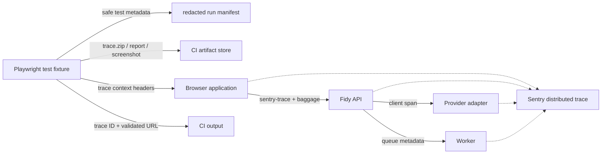

# Research 008: Sentry CI E2E instrumentation and artifact support

- **Issue:** [#92 — Establish Sentry CI E2E instrumentation and artifact support](https://github.com/B4rz99/fidy-ai/issues/92)
- **Map:** [#91 — Sentry end-to-end observability for Fidy](https://github.com/B4rz99/fidy-ai/issues/91)
- **Date:** 2026-08-04
- **Status:** Planning source; this note does not implement SDK wiring, a Playwright suite, a CI workflow, or Sentry account configuration.
- **Evidence convention:** **Sourced fact** is directly supported by the linked first-party documentation or source. **Design conclusion** applies those facts to Fidy and is not a Sentry product promise.

## Question and boundary

The question is whether a future CI end-to-end harness—possibly using Playwright—can capture complete Sentry traces, connect browser/API/provider work, associate the run with the tested commit, retain useful failure context, and print a useful trace link. GitHub pull-request/check linking is deliberately excluded, as requested by issue #91. This note treats Sentry distributed tracing and Playwright's browser/test artifacts as two different products with different retention, privacy, and linking rules.

## Short answer

| Need                                | Support                                                                                                                                                                                                                                                                                                                                                                                                                                                                                                               | Design conclusion for Fidy                                                                                                                                                                                                                                               |
| ----------------------------------- | --------------------------------------------------------------------------------------------------------------------------------------------------------------------------------------------------------------------------------------------------------------------------------------------------------------------------------------------------------------------------------------------------------------------------------------------------------------------------------------------------------------------- | ------------------------------------------------------------------------------------------------------------------------------------------------------------------------------------------------------------------------------------------------------------------------ |
| 100% **Sentry trace** capture in CI | **Yes.** Sentry documents `tracesSampleRate: 1.0` as capturing 100% of spans; head-based sampling means the root decision must be sampled and inherited downstream. [Sourced fact: Sentry's JavaScript distributed-tracing setup](https://docs.sentry.io/platforms/javascript/tracing/distributed-tracing/); [Sentry trace-propagation specification](https://develop.sentry.dev/sdk/foundations/trace-propagation/)                                                                                                  | Enable 1.0 only for the CI project/environment, in the runner, browser, API, and any worker/provider adapter that emits spans. Verify quotas before making this the permanent workflow default.                                                                          |
| 100% **Playwright trace.zip** files | **Yes, but costly.** Playwright's `trace: 'on'` records every test and is explicitly described as performance-heavy. `retain-on-failure` preserves failed tests while deleting successful-run traces; `on-first-retry` is the lower-cost CI recommendation when retries are enabled. [Sourced fact: Playwright Trace Viewer](https://playwright.dev/docs/trace-viewer)                                                                                                                                                | Use `retain-on-failure` for failure context, or `on` only when the requirement truly means every browser artifact. Test the no-retry, retry, timeout, and browser-crash cases separately.                                                                                |
| Browser → API trace linking         | **Yes.** The browser SDK propagates `sentry-trace` and `baggage` to matching requests; the receiving SDK continues the trace. Cross-origin requests also require matching `tracePropagationTargets` and CORS headers. [Sourced fact: [distributed tracing](https://docs.sentry.io/platforms/javascript/tracing/distributed-tracing/) and [CORS](https://docs.sentry.io/platforms/javascript/tracing/distributed-tracing/dealing-with-cors-issues/)]                                                                   | Configure the CI browser's API origin explicitly and assert the trace ID at the API boundary. Do not infer success merely because both services sent independent Sentry events.                                                                                          |
| API → provider spans                | **Yes for Fidy's outbound operation.** Sentry supports automatic HTTP propagation and manual/custom spans. The provider's internal work is not visible unless that provider also emits compatible telemetry. [Sourced fact: [Node instrumentation](https://docs.sentry.io/platforms/javascript/guides/node/tracing/instrumentation/) and [custom propagation](https://docs.sentry.io/platforms/javascript/guides/node/tracing/distributed-tracing/custom-instrumentation/)]                                           | Wrap Kapso, Resend, Wompi, database, and other provider calls in safe Fidy spans. Treat these as client-side provider spans, not evidence that a third party's internal trace is available.                                                                              |
| Commit/release association          | **Yes.** SDK events carry a release; Sentry recommends a Git commit hash as a release identifier, and `sentry-cli releases set-commits` associates commit metadata. [Sourced fact: [release configuration](https://docs.sentry.io/platforms/javascript/configuration/releases/), [release naming](https://docs.sentry.io/product/releases/naming-releases/), and [associate commits](https://docs.sentry.io/product/releases/associate-commits/)]                                                                     | Use one slash-free release derived from the full tested SHA and `environment=ci`; use a CI-only project or otherwise isolate CI volume before enabling 100% capture. This is release metadata, not PR/check linking.                                                     |
| Failed-run context                  | **Yes, primarily as CI artifacts.** Playwright can retain trace zips, HTML reports, screenshots, videos, and attachments; Sentry can store generic event attachments, but it has no documented Playwright trace-viewer artifact type. [Sourced fact: [Playwright reporters](https://playwright.dev/docs/test-reporters) and [Sentry attachments](https://docs.sentry.io/platforms/javascript/enriching-events/attachments/)]                                                                                          | Upload redacted Playwright artifacts through the CI artifact store with `always`-style failure cleanup. Keep only a small, metadata-only manifest or event attachment in Sentry if needed; do not send raw trace zips by default.                                        |
| Trace URL in CI output              | **Partly first-class.** Sentry exposes a trace ID and a documented trace-retrieval API, and Trace View supports shareable links. The JavaScript SDK does not document a stable `getTraceUrl` helper, and Sentry's frontend route is implementation/version dependent. [Sourced fact: [trace API](https://docs.sentry.io/api/discover/retrieve-a-trace/), [Trace View](https://docs.sentry.io/concepts/key-terms/tracing/trace-view/), and [JS APIs](https://docs.sentry.io/platforms/javascript/configuration/apis/)] | Print the trace ID unconditionally and a configured/validated Sentry UI URL when the chosen SaaS/self-hosted route is known. Optionally poll the trace API after flushing to avoid printing a link for data that was never ingested. Never put an auth token in the URL. |

## Repository baseline

**Sourced facts:** the current application manifest contains Effect/Bun/Vitest dependencies but no Sentry or Playwright dependency ([`package.json`, lines 27–44](../package.json#L27-L44)). The current GitHub Actions workflow has lint, unit/core tests, database tests, mutation/CRAP, image, and security jobs, but no browser or E2E job ([`.github/workflows/ci.yml`, lines 1–11 and 157–203](../.github/workflows/ci.yml#L1-L11)). The main Vitest configuration runs `src/**/*.test.ts` in the Node environment ([`vitest.config.ts`, lines 22–24](../vitest.config.ts#L22-L24)).

**Design conclusion:** this is a future harness, not an extension of the current Vitest job. It needs its own Playwright/browser dependencies, service startup and teardown, Sentry CI credentials, release step, artifact upload, and failure-safe cleanup. The map already requires CI E2E traces at 100%, metadata-only telemetry, separate operator access, and no current PR links ([issue #91](https://github.com/B4rz99/fidy-ai/issues/91)).

## Sourced model: two kinds of trace

### Sentry distributed trace

A Sentry trace is a set of connected transactions/spans identified by a trace ID. Sentry describes spans as timed operations such as browser actions, HTTP requests, database work, and functions; a distributed trace crosses instrumented services by propagating the trace ID ([Sentry tracing concepts](https://docs.sentry.io/concepts/key-terms/tracing/) and [Trace Explorer](https://docs.sentry.io/product/trace-explorer/)). The normal carriers are the `sentry-trace` and `baggage` headers ([Sentry JavaScript distributed tracing](https://docs.sentry.io/platforms/javascript/tracing/distributed-tracing/)).

Sampling and propagation are related but not identical. Sentry's SDK specification says trace propagation continues even when span collection is disabled, and a receiving SDK must continue incoming context and propagate it downstream; with no incoming decision, it may defer sampling to a downstream SDK ([trace-propagation specification](https://develop.sentry.dev/sdk/foundations/trace-propagation/)). A trace can therefore be causally connected while missing performance data. Sentry also documents missing trace sections caused by sampling, rate limits, permissions, or span limits ([Trace View](https://docs.sentry.io/concepts/key-terms/tracing/trace-view/)).

**Design conclusion:** “100% Sentry traces” means every CI test root is sampled and every participating Sentry SDK has permission and quota to send its spans. It does not mean Sentry can recover spans that an unsampled parent, rate limit, quota, SDK shutdown, or unsupported boundary discarded.

### Playwright test-run artifacts

Playwright's trace viewer is a test-run debugger. A `trace.zip` can show test actions, source locations, DOM snapshots, errors, console output, network requests, and attachments; the network view can expose request/response headers and bodies ([Playwright Trace Viewer](https://playwright.dev/docs/trace-viewer)). Playwright can open a local zip, or a remotely hosted zip through `trace.playwright.dev/?trace=...` ([same Playwright documentation](https://playwright.dev/docs/trace-viewer)).

Playwright's `trace` option has different retention modes: `on-first-retry`, `on-all-retries`, `off`, `on`, and `retain-on-failure`. The documentation recommends `on-first-retry` on CI, calls `on` performance-heavy, and specifically recommends `retain-on-failure` when retries are not enabled ([Playwright Trace Viewer, “Tracing on CI”](https://playwright.dev/docs/trace-viewer)). The HTML reporter creates a self-contained report, supports a separate `attachmentsBaseURL`, and can be served later with `show-report`; custom reporters can emit per-test and end-of-run data ([Playwright reporters](https://playwright.dev/docs/test-reporters)).

**Design conclusion:** a Playwright trace zip is not a Sentry distributed trace. It records what the test runner observed, while Sentry records sampled telemetry emitted by instrumented processes. The zip does not automatically acquire a Sentry trace ID, and a Sentry trace does not contain Playwright's DOM snapshots or test action timeline. Fidy should keep an explicit metadata-only mapping between them:



## Sentry instrumentation findings

### Capture 100% of CI traces

**Sourced facts:** Sentry's JavaScript and Node setup examples use `tracesSampleRate: 1.0` for 100% span capture and describe that setting as useful for development/debugging ([JavaScript distributed tracing](https://docs.sentry.io/platforms/javascript/tracing/distributed-tracing/) and [Node distributed tracing](https://docs.sentry.io/platforms/javascript/guides/node/tracing/distributed-tracing/)). Sentry uses head-based sampling: the originating service decides and downstream services inherit the decision ([Node distributed tracing](https://docs.sentry.io/platforms/javascript/guides/node/tracing/distributed-tracing/)). The SDK specification states that an incoming sampling decision takes precedence over a child SDK's local `tracesSampleRate` ([trace-propagation specification](https://develop.sentry.dev/sdk/foundations/trace-propagation/)).

**Design conclusion:** the future CI environment should set, in every process that emits application telemetry:

- a CI DSN/project and `environment=ci`;
- the same slash-free `release` value derived from the tested full SHA;
- `tracesSampleRate: 1.0` (or an equivalent `tracesSampler` branch that returns 1 for this controlled CI environment);
- a safe run identifier and test name/worker tags, with no UserId, financial/conversational data, request bodies, credentials, cookies, or auth headers, matching issue #91's metadata-only boundary ([issue #91](https://github.com/B4rz99/fidy-ai/issues/91)).

The browser/test root must be sampled. Setting `1.0` only in the API cannot resample a browser trace whose upstream decision was negative. CI must also flush/await the SDK before the runner or service exits. Sentry's JS API documents `flush(timeout?)` as draining the pending event queue and `close(timeout?)` as draining then disabling the SDK ([JavaScript APIs](https://docs.sentry.io/platforms/javascript/configuration/apis/)).

**Cost caveat:** Sentry's Trace Explorer explains that sampling rates affect stored span counts and that Sentry's retention/quota behavior is plan-dependent ([Trace Explorer](https://docs.sentry.io/product/trace-explorer/) and [data retention](https://docs.sentry.io/security-legal-pii/security/data-retention-periods/)). A 100% CI setting is technically supported, but the selected plan, project quota, retention, and test volume are prerequisites rather than assumptions.

### Browser → API

**Sourced facts:** `browserTracingIntegration` automatically instruments browser pageload/navigation and outgoing requests; the first-party JavaScript source also exposes the integration and its outgoing-request instrumentation ([Sentry browser tracing source at commit `5e76abe234ff0117cccb042ad1148c5a4e11dde6`](https://github.com/getsentry/sentry-javascript/blob/5e76abe234ff0117cccb042ad1148c5a4e11dde6/packages/browser/src/tracing/browserTracingIntegration.ts)). Sentry's browser integration attaches `sentry-trace` and `baggage` only to URLs matching `tracePropagationTargets`; for cross-origin requests the API must allow those headers through CORS ([Sentry CORS guidance](https://docs.sentry.io/platforms/javascript/tracing/distributed-tracing/dealing-with-cors-issues/)). Browser tracing can continue an upstream trace from `sentry-trace` and `baggage` HTML meta tags ([Sentry custom trace propagation](https://docs.sentry.io/platforms/javascript/tracing/distributed-tracing/custom-instrumentation/)).

The browser SDK starts a new trace on page load and on navigation. Sentry's documentation says a navigation span begins a new trace, although linked previous/next traces can be browsed in Trace View ([Sentry distributed tracing](https://docs.sentry.io/platforms/javascript/tracing/distributed-tracing/) and [Trace View](https://docs.sentry.io/concepts/key-terms/tracing/trace-view/)). Browser active-span hierarchy also has a deliberate limitation: the JavaScript instrumentation docs say browser spans default to a flat hierarchy because parallel asynchronous operations cannot reliably identify their parent ([Sentry instrumentation](https://docs.sentry.io/platforms/javascript/tracing/instrumentation/)).

**Design conclusion:** configure the CI browser with the exact local/CI API origin in `tracePropagationTargets`, allow `sentry-trace` and `baggage` in the API's CORS policy, and verify headers at the API boundary. Do not promise that every Playwright action becomes a perfectly nested child span or that a multi-page test has one trace unless the harness explicitly re-establishes the test context for each navigation.

A viable experiment is to start a Sentry root span in a test fixture, obtain its propagation headers with `Sentry.getTraceData()`, and install a Playwright `browserContext.addInitScript` that creates the two meta tags before application scripts execute. Playwright documents that `addInitScript` runs after document creation but before page scripts ([BrowserContext API](https://playwright.dev/docs/api/class-browsercontext#browser-context-add-init-script)); Sentry documents that the browser tracing integration consumes those meta tags ([Sentry custom trace propagation](https://docs.sentry.io/platforms/javascript/tracing/distributed-tracing/custom-instrumentation/)). This is a design hypothesis that must be tested for every page/navigation pattern; it is not a new production protocol yet.

### API → database, providers, and asynchronous workers

**Sourced facts:** Sentry's Node guidance says server-side SDKs continue an incoming HTTP trace, start a root trace when no incoming context exists, and automatically propagate headers for outgoing HTTP; its custom instrumentation API supports `startSpan`, `continueTrace`, and `getTraceData` ([Node distributed tracing](https://docs.sentry.io/platforms/javascript/guides/node/tracing/distributed-tracing/) and [Node custom propagation](https://docs.sentry.io/platforms/javascript/guides/node/tracing/distributed-tracing/custom-instrumentation/)). The SDK specification lists queue metadata as a trace carrier and says `SENTRY_TRACE`/`SENTRY_BAGGAGE` can carry context to another process ([trace-propagation specification](https://develop.sentry.dev/sdk/foundations/trace-propagation/)). The JavaScript instrumentation API recommends active spans around synchronous/asynchronous work and permits safe attributes on spans ([Sentry instrumentation](https://docs.sentry.io/platforms/javascript/tracing/instrumentation/)).

**Design conclusion:**

1. The API request span should continue the browser's trace.
2. Database work and each external provider operation should be a child span with an allowlisted operation/name and provider hostname only; provider request/response content stays out of telemetry.
3. If a durable queue job is causally caused by the API request, carry only the Sentry propagation metadata in the queue record or message and call `continueTrace` in the worker. The worker must end the short API transaction before model/provider waits, in keeping with Fidy's existing transaction boundaries ([server architecture, §5–§6](../apps/server/ARCHITECTURE.md)).
4. Independently scheduled work must start a new root trace. It may carry a safe run/correlation tag, but it must not be made a false child merely because it happened near the test.
5. A provider call span proves that Fidy made and timed an outbound operation. It does not make Kapso, Resend, Wompi, PostgreSQL, or another provider's internal work part of the Sentry trace unless that external system emits compatible telemetry and propagates it back.

The E2E assertion should inspect the trace retrieved from Sentry and check the expected trace ID, parent relationship, provider span names, release, environment, and safe attributes. It should not assert on raw URL query strings, request bodies, prompts, financial data, or credentials.

### Runtime/package prerequisite for Fidy

**Sourced facts:** the reviewed first-party `getsentry/sentry-javascript` package tree contains a Bun package and an Effect package but no package named Playwright at the reviewed commit ([package tree at commit `5e76abe234ff0117cccb042ad1148c5a4e11dde6`](https://github.com/getsentry/sentry-javascript/tree/5e76abe234ff0117cccb042ad1148c5a4e11dde6/packages)). Its Bun README labels `@sentry/bun` as **Beta** ([Bun README at that commit](https://github.com/getsentry/sentry-javascript/blob/5e76abe234ff0117cccb042ad1148c5a4e11dde6/packages/bun/README.md)); its Effect README labels `@sentry/effect` **Alpha**, says it supports Effect v3 and v4 beta, and says documentation is not yet available ([Effect README at that commit](https://github.com/getsentry/sentry-javascript/blob/5e76abe234ff0117cccb042ad1148c5a4e11dde6/packages/effect/README.md)).

**Design conclusion:** do not assume an official Playwright-runner integration. Instrument the browser application with the browser SDK, instrument the Bun/Effect application with the package and version chosen by issue #94, and write a narrow Playwright fixture/reporter for test-run spans and metadata. The first implementation experiment must verify that the selected Bun/Effect SDK handles Fidy's actual HTTP, Effect async context, database, queue, and provider boundaries; the existence of a package is not proof of feature parity or production readiness.

## Releases and commit association

**Sourced facts:** setting `release` on the JavaScript SDK tags events with that release; Sentry recommends a Git identifying hash as a release identifier ([JavaScript releases](https://docs.sentry.io/platforms/javascript/configuration/releases/) and [release naming](https://docs.sentry.io/product/releases/naming-releases/)). Release names are organization-wide and cannot contain `/`, `\\`, whitespace-only values, or exceed 200 characters ([release naming](https://docs.sentry.io/product/releases/naming-releases/)). Sentry's documented CLI sequence is to create a release and run `sentry-cli releases set-commits --auto`; manual commit ranges require the full SHA, and `--auto` needs a discoverable Git tree ([associate commits](https://docs.sentry.io/product/releases/associate-commits/) and [CLI release management](https://docs.sentry.io/cli/releases/)).

**Design conclusion:** use a value such as `fidy-ai@ci+<full-sha>` (or another agreed slash-free convention) consistently in the runner, browser build, API, and worker. Use `environment=ci` and a non-sensitive `ci_run_id` tag. Create the release before the E2E process emits events, associate the full tested commit, and finalize/deploy it as a CI environment only if the chosen workflow needs a deployment record. If source is bundled/minified, upload browser source maps for the same release; Sentry says source maps are needed for original stack traces and before suspect-commit features ([release setup](https://docs.sentry.io/product/releases/setup/)).

The current workflows use `actions/checkout` without an explicit full-history option ([`.github/workflows/ci.yml`](../.github/workflows/ci.yml)). **Conclusion:** a future release step using `set-commits --auto` should either check out full history or use the documented manual full-SHA/range form. This research does not add a GitHub integration, PR link, or check annotation.

## Failed-run context and artifact policy

### Playwright artifacts

**Sourced facts:** `trace: 'retain-on-failure'` records each test but removes successful traces, while `trace: 'on-first-retry'` records the first retry and `trace: 'on'` records each test with a performance warning ([Playwright Trace Viewer](https://playwright.dev/docs/trace-viewer)). The test configuration has an `outputDir` for screenshots, videos, traces, and other artifacts ([Playwright configuration](https://playwright.dev/docs/test-configuration)). The HTML reporter is self-contained and can point at separately hosted attachments using `attachmentsBaseURL`; custom reporters can receive each test result and the final run result ([Playwright reporters](https://playwright.dev/docs/test-reporters)).

**Design conclusion:** the future workflow should:

- set a deterministic output directory such as `test-results/`;
- retain traces on failures and, if retries are used, decide whether a flaky test's first retry is sufficient or whether every final failure needs `retain-on-failure`;
- collect screenshots/video only on failure unless an experiment proves that all-run capture is affordable;
- upload the HTML report and `test-results/**` in an unconditional cleanup step, including when the test command exits non-zero or a browser crashes;
- publish a redacted manifest that maps test title/project/worker/retry/status to the Sentry trace ID and local artifact paths;
- use synthetic data and inspect generated zips/reports for cookies, authorization headers, request/response bodies, DOM text, and financial/conversational content before broadening access.

Playwright's remote trace URL only works when the zip is hosted at an accessible URL, and its documentation notes that CORS may apply ([Playwright Trace Viewer](https://playwright.dev/docs/trace-viewer)). A private CI artifact download URL may require authentication or expire, so the workflow must define who can access artifacts and for how long rather than printing a misleading public link.

### Sentry attachments

**Sourced facts:** Sentry attachments are attached to an event scope, accept a string or `Uint8Array`, and accept any MIME type; the UI renders a documented subset including text, images, and video ([Sentry JavaScript attachments](https://docs.sentry.io/platforms/javascript/enriching-events/attachments/)). Sentry says attachment retention is 30 or 90 days depending on plan, storage counts against quota, and access is controlled by organization settings ([same attachments documentation](https://docs.sentry.io/platforms/javascript/enriching-events/attachments/) and [retention periods](https://docs.sentry.io/security-legal-pii/security/data-retention-periods/)). Sentry separately documents attachment scrubbing through `$attachments` selectors and warns that file-format-preserving scrubbing cannot change attachment length ([attachment scrubbing](https://docs.sentry.io/security-legal-pii/scrubbing/attachment-scrubbing/)).

**Design conclusion:** a redacted text manifest, small screenshot, or provider-safe diagnostic file could be attached to a captured failure event if the plan and access policy permit it. A raw Playwright `trace.zip` may be accepted as a generic binary attachment, but Sentry does not document a Playwright viewer for it, `application/zip` is not among the listed rendered MIME types, and the zip can contain the browser/network data described above. Store the raw trace in the CI artifact store instead. Do not rely on Sentry's ordinary event scrubbing to make an arbitrary browser zip safe; pre-redact or omit it. This follows issue #91's deny-by-default, metadata-only policy ([issue #91](https://github.com/B4rz99/fidy-ai/issues/91)).

## Trace ID and CI output

### What is available

**Sourced facts:** the JavaScript API exposes `getActiveSpan()` and `lastEventId()`; `lastEventId()` returns the last sent error event ID but explicitly does not guarantee that the event was retained/sent ([Sentry JavaScript APIs](https://docs.sentry.io/platforms/javascript/configuration/apis/)). The first-party SDK's `Span` interface exposes `spanContext()` containing `traceId` and `spanId`, and its implementation serializes `trace_id` into the Sentry transaction/span payload ([SDK `Span` type at commit `5e76abe234ff0117cccb042ad1148c5a4e11dde6`](https://github.com/getsentry/sentry-javascript/blob/5e76abe234ff0117cccb042ad1148c5a4e11dde6/packages/core/src/types/span.ts) and [implementation](https://github.com/getsentry/sentry-javascript/blob/5e76abe234ff0117cccb042ad1148c5a4e11dde6/packages/core/src/tracing/sentrySpan.ts)). Sentry documents `GET /api/0/organizations/{organization}/trace/{trace_id}/` to retrieve the spans, errors, and related items for a 32-character hexadecimal trace ID ([retrieve a trace](https://docs.sentry.io/api/discover/retrieve-a-trace/)).

Sentry Trace View supports clicking a trace ID and sharing the resulting URL ([Trace View](https://docs.sentry.io/concepts/key-terms/tracing/trace-view/)). However, the current Sentry frontend builds trace detail routes through an internal `getTraceDetailsUrl` helper and a performance-view base URL ([Sentry frontend source at commit `47585e06f3df102c764575363317d956299c651f`, `traceDetails/utils.tsx`](https://github.com/getsentry/sentry/blob/47585e06f3df102c764575363317d956299c651f/static/app/views/performance/traceDetails/utils.tsx) and [`performance/utils/index.tsx`](https://github.com/getsentry/sentry/blob/47585e06f3df102c764575363317d956299c651f/static/app/views/performance/utils/index.tsx)). A first-party Sentry issue records an older working form as `/organizations/{org}/explore/traces/trace/{trace_id}` ([Sentry issue #105609](https://github.com/getsentry/sentry/issues/105609)). These sources show that a human UI URL is feasible but that its exact route is not a stable SDK/API contract across Sentry versions or self-hosted deployments.

### Proposed CI output

**Design conclusion:** a custom test fixture/reporter should, for each test:

1. start one sampled Sentry test span before page navigation;
2. save `span.spanContext().traceId` before ending it;
3. run the test and finish/flush the span and all application SDKs;
4. write a redacted manifest containing the trace ID, release, environment, test identifier, status, and artifact paths;
5. print the trace ID unconditionally;
6. print a Sentry UI link generated from a configured base URL/org slug/route template only after an integration check against the selected Sentry deployment; and
7. optionally poll the documented trace API with a CI-only auth token, then print the UI link only when the trace is present. The token must stay in the process environment and never appear in stdout, the manifest, or a URL.

A representative output shape is:

```text
Sentry trace ID: 0123456789abcdef0123456789abcdef
Sentry trace URL: https://<configured-sentry>/organizations/<org>/.../trace/0123456789abcdef0123456789abcdef/
Playwright report: <CI artifact/report URL or local artifact path>
Playwright trace: <CI artifact URL or local trace.zip path>
```

The `...` route is intentionally configuration-driven rather than hard-coded in this note. If the UI route cannot be validated, printing the trace ID and the documented API retrieval location is safer than printing a broken link. This satisfies trace discoverability without adding GitHub PR/check links.

## Recommended future harness shape

This is a **design conclusion**, not an implementation plan for this ticket:

1. **CI setup:** create/select a CI Sentry project and DSN, set `release`, `environment=ci`, safe run metadata, and 100% tracing. Install the chosen Playwright version/browser binaries and start the Fidy API/browser services with the same release metadata.
2. **Test root:** a test-scoped fixture starts a root Sentry span in the runner. It uses `getTraceData()` to provide `sentry-trace` and `baggage` to the browser bootstrap. A custom fixture is preferable to global setup because Playwright fixtures are isolated per test ([Playwright fixtures](https://playwright.dev/docs/test-fixtures)).
3. **Browser:** initialize the browser SDK with `browserTracingIntegration`, explicit CI API `tracePropagationTargets`, and 100% sample rate. Reapply the incoming trace context for every navigation if the acceptance criterion is one trace per test; otherwise record one trace ID per page load/navigation.
4. **API/provider:** continue incoming context, create safe database/provider spans, and propagate context explicitly across the durable queue. Ensure external calls cannot put bodies, headers, prompts, or credentials into span names/attributes.
5. **Reporter:** collect only test metadata, Sentry trace IDs, release/environment, and artifact paths. Do not capture the page's text or network payloads into Sentry.
6. **Failure handling:** configure Playwright's chosen trace mode, upload report/artifacts even on failure, and call `flush` in runner/service teardown. Sentry transport failure must not change the product test's business result, consistent with issue #91's non-interference requirement ([issue #91](https://github.com/B4rz99/fidy-ai/issues/91)).
7. **Output:** print the trace ID, validated Sentry URL when available, and CI artifact locations. Do not add PR/check linking in this design.

## Prerequisites

1. **Sentry account decisions:** a project/DSN for CI, organization access, data region, attachment access, quotas, retention, and whether CI should be a separate project or only `environment=ci`. Sentry's retention differs by data type and plan ([retention periods](https://docs.sentry.io/security-legal-pii/security/data-retention-periods/)).
2. **SDK decision:** issue #94 must choose the supported Bun/Effect path and versions. The reviewed first-party packages are Beta/Alpha as noted above; verify their actual HTTP, Effect async, database, queue, and flush behavior before relying on them.
3. **Browser/API boundary:** exact CI origins, `tracePropagationTargets`, CORS allow-list, and a safe test-only page/bootstrap mechanism for incoming meta tags.
4. **Test environment:** a deterministic synthetic User and database/provider fixtures, service startup/teardown, browser installation, network isolation, and a rule that no production user or provider credential enters CI artifacts.
5. **Release pipeline:** full tested SHA, release creation/commit association, browser source-map upload if applicable, and secret-scoped Sentry CLI credentials. Full Git history is needed for `set-commits --auto`, or the workflow must pass full SHA/range metadata ([associate commits](https://docs.sentry.io/product/releases/associate-commits/)).
6. **Artifact pipeline:** CI artifact storage, retention and access policy, unconditional upload behavior, report/trace URL accessibility, and a pre-upload redaction check. The Sentry attachment path is optional and must not replace CI artifact retention.
7. **Trace discoverability:** configured Sentry base URL/org slug, route validation for SaaS and any self-hosted deployment, API-polling permissions if used, and a timeout/fallback policy that prints IDs without failing the E2E test.
8. **Privacy/security gate:** allowlisted tags/span attributes, `beforeSend`/`beforeSendSpan` tests where the selected SDK supports them, synthetic data, and inspection of Playwright zips/reports. Sentry's attachment scrubber is a secondary control, not permission to upload raw browser state ([attachment scrubbing](https://docs.sentry.io/security-legal-pii/scrubbing/attachment-scrubbing/)).

## Experiments required before implementation is accepted

1. **Minimal end-to-end trace:** run a synthetic Playwright test against a browser app and API with sample rate 1. Retrieve the trace through Sentry's API and assert that the browser page load, API operation, and one safe provider span share the expected trace ID and release.
2. **Runner-to-browser propagation:** inject the test root's meta tags using `browserContext.addInitScript`; verify on every supported Chromium/Firefox/WebKit project and on a second navigation that the API receives the expected trace ID. Confirm whether Playwright fixture setup performs any application navigation before the injection is installed.
3. **Trace boundaries:** deliberately run a multi-page test and record whether the chosen policy is one trace per test, one per navigation, or a parent test span plus linked navigation traces. Reject an undocumented assumption about “one trace per test.”
4. **Bun/Effect compatibility:** compare the selected `@sentry/bun`/`@sentry/effect` setup with direct custom spans. Verify inbound HTTP continuation, async context isolation under parallel requests, provider spans, queue metadata, and `flush` on normal and failing shutdown.
5. **Queue continuation:** enqueue a synthetic job with only `sentry-trace`/`baggage` metadata; run the worker after the originating request has ended; retrieve the trace and verify the worker span's parent/trace relationship. Also verify an independently scheduled job creates a new root.
6. **Provider boundary:** use fake Kapso/Resend/Wompi-like endpoints and assert that only safe method/provider/status/duration attributes leave Fidy. Confirm no external provider response is incorrectly treated as a child Sentry span.
7. **Artifact modes:** exercise a passing test, a failure with no retries, a failure that passes on first retry, a final retry failure, timeout, and browser crash. Verify trace/report/screenshot/video retention and unconditional upload for each case.
8. **Artifact privacy:** inspect the generated zip, HTML report, screenshots, video, and manifest for cookies, authorization headers, request/response bodies, DOM text, secrets, and financial/conversational data. Test whether any chosen CI artifact URL is private, accessible to intended operators, and usable by the Playwright viewer.
9. **Release/source maps:** create a release from a full SHA, associate commits, upload the browser source maps, run the E2E test, and verify that Sentry events/spans show the release and readable source locations. Do this without installing a repository integration or adding PR/check links.
10. **Trace link:** after `flush`, poll the trace API, generate the configured UI route, and verify the printed link on the chosen Sentry SaaS/self-hosted version. Test the missing/slow-ingestion fallback and confirm that auth tokens never appear in output.
11. **Volume/retention:** run a representative parallel CI shard at 100% and measure span count, quota usage, ingestion latency, retention, and total run time before making all-run capture the default.

## Unresolved questions

1. Which Sentry plan, data region, CI project, retention period, attachment policy, and quota are available? Can the selected plan sustain 100% traces for the expected parallel E2E volume?
2. Which runtime is the Playwright runner—Node or Bun—and which first-party Sentry Bun/Effect SDK version will issue #94 approve? Is the Alpha Effect integration acceptable for this development-stage codebase?
3. Does Fidy require one Sentry trace per Playwright test across multiple navigations, or is one trace per page load/navigation with a test-level manifest sufficient?
4. Can a test-only `addInitScript` meta-tag bootstrap reliably precede the browser SDK on every supported browser, route, redirect, and page reload without changing production behavior?
5. Which Fidy provider operations and durable queue transitions are causally part of the browser request, and which are independently scheduled roots? What exact safe propagation metadata can be persisted?
6. Will CI artifacts be retained in GitHub Actions or another private store, for how long, and who may download them? Can those URLs be opened by Playwright Trace Viewer without exposing data publicly?
7. Should Sentry ever receive a failure attachment, or should it receive only a metadata manifest while raw browser artifacts remain in CI storage?
8. Which Sentry UI trace route is supported by the selected SaaS/self-hosted version, and should the reporter poll the documented trace API before printing it? The trace ID itself is the stable fallback.
9. What exact allowlist and automated tests will prove that Sentry events, spans, manifests, screenshots, videos, and Playwright zips remain metadata-only?

## Primary sources

### Repository and issue

- [Issue #92](https://github.com/B4rz99/fidy-ai/issues/92)
- [Issue #91](https://github.com/B4rz99/fidy-ai/issues/91)
- [`package.json`](../package.json)
- [`.github/workflows/ci.yml`](../.github/workflows/ci.yml)
- [`vitest.config.ts`](../vitest.config.ts)
- [Server architecture](../apps/server/ARCHITECTURE.md)

### Sentry documentation and first-party source

- [Tracing concepts](https://docs.sentry.io/concepts/key-terms/tracing/)
- [Trace View](https://docs.sentry.io/concepts/key-terms/tracing/trace-view/)
- [Trace Explorer](https://docs.sentry.io/product/trace-explorer/)
- [JavaScript distributed tracing](https://docs.sentry.io/platforms/javascript/tracing/distributed-tracing/)
- [JavaScript CORS guidance](https://docs.sentry.io/platforms/javascript/tracing/distributed-tracing/dealing-with-cors-issues/)
- [JavaScript instrumentation](https://docs.sentry.io/platforms/javascript/tracing/instrumentation/)
- [Node distributed tracing](https://docs.sentry.io/platforms/javascript/guides/node/tracing/distributed-tracing/)
- [Node custom trace propagation](https://docs.sentry.io/platforms/javascript/guides/node/tracing/distributed-tracing/custom-instrumentation/)
- [JavaScript APIs](https://docs.sentry.io/platforms/javascript/configuration/apis/)
- [JavaScript releases](https://docs.sentry.io/platforms/javascript/configuration/releases/)
- [Release naming](https://docs.sentry.io/product/releases/naming-releases/)
- [Associate commits](https://docs.sentry.io/product/releases/associate-commits/)
- [CLI release management](https://docs.sentry.io/cli/releases/)
- [Release setup](https://docs.sentry.io/product/releases/setup/)
- [JavaScript attachments](https://docs.sentry.io/platforms/javascript/enriching-events/attachments/)
- [Attachment scrubbing](https://docs.sentry.io/security-legal-pii/scrubbing/attachment-scrubbing/)
- [Data retention](https://docs.sentry.io/security-legal-pii/security/data-retention-periods/)
- [Retrieve a trace API](https://docs.sentry.io/api/discover/retrieve-a-trace/)
- [SDK trace-propagation specification](https://develop.sentry.dev/sdk/foundations/trace-propagation/)
- [Sentry JS package tree at reviewed commit](https://github.com/getsentry/sentry-javascript/tree/5e76abe234ff0117cccb042ad1148c5a4e11dde6/packages)
- [Sentry Bun README at reviewed commit](https://github.com/getsentry/sentry-javascript/blob/5e76abe234ff0117cccb042ad1148c5a4e11dde6/packages/bun/README.md)
- [Sentry Effect README at reviewed commit](https://github.com/getsentry/sentry-javascript/blob/5e76abe234ff0117cccb042ad1148c5a4e11dde6/packages/effect/README.md)
- [Sentry browser tracing source at reviewed commit](https://github.com/getsentry/sentry-javascript/blob/5e76abe234ff0117cccb042ad1148c5a4e11dde6/packages/browser/src/tracing/browserTracingIntegration.ts)
- [Sentry JS Span type at reviewed commit](https://github.com/getsentry/sentry-javascript/blob/5e76abe234ff0117cccb042ad1148c5a4e11dde6/packages/core/src/types/span.ts)
- [Sentry JS span implementation at reviewed commit](https://github.com/getsentry/sentry-javascript/blob/5e76abe234ff0117cccb042ad1148c5a4e11dde6/packages/core/src/tracing/sentrySpan.ts)
- [Sentry frontend trace URL builder at reviewed commit](https://github.com/getsentry/sentry/blob/47585e06f3df102c764575363317d956299c651f/static/app/views/performance/traceDetails/utils.tsx)
- [Sentry frontend performance URL builder at reviewed commit](https://github.com/getsentry/sentry/blob/47585e06f3df102c764575363317d956299c651f/static/app/views/performance/utils/index.tsx)
- [Sentry trace-route issue #105609](https://github.com/getsentry/sentry/issues/105609)

### Playwright documentation

- [Trace Viewer](https://playwright.dev/docs/trace-viewer)
- [Configuration](https://playwright.dev/docs/test-configuration)
- [Reporters](https://playwright.dev/docs/test-reporters)
- [BrowserContext `addInitScript`](https://playwright.dev/docs/api/class-browsercontext#browser-context-add-init-script)
- [Test fixtures](https://playwright.dev/docs/test-fixtures)
