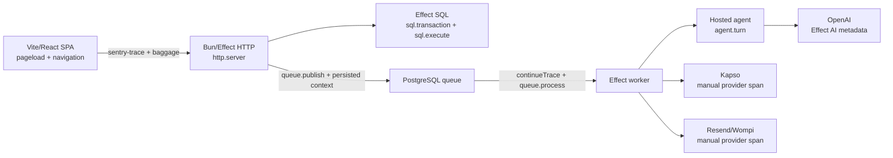

# Research 008: Supported Sentry tracing path for Fidy

- **Issue:** [#96 — Establish the supported Sentry tracing path for Fidy's runtime surfaces](https://github.com/B4rz99/fidy-ai/issues/96)
- **Map:** [#91 — Sentry end-to-end observability for Fidy](https://github.com/B4rz99/fidy-ai/issues/91)
- **Date:** 2026-08-04
- **Status:** planning research; no instrumentation is implemented by this note.
- **Evidence convention:** **Fact** means the linked Sentry documentation, first-party source, Effect checkout, or Fidy source states it. **Conclusion** means the proposed application of those facts to Fidy. **Conflict / experiment** records a question that the sources do not settle.

## Executive decision

1. **Use Sentry's native JavaScript SDKs as the initial sink.** The browser path is `@sentry/react` with `browserTracingIntegration`; the Bun process path is `@sentry/bun`, initialized from a preload before Fidy's imports. Sentry documents `@sentry/bun` as a beta SDK, but it has a native `Bun.serve` integration, manual span APIs, propagation APIs, and the required HTTP/queue primitives ([Bun setup](https://docs.sentry.io/platforms/javascript/guides/bun/), [Bun npm README](https://www.npmjs.com/package/@sentry/bun), [Bun integration source](https://github.com/getsentry/sentry-javascript/blob/5e76abe234ff0117cccb042ad1148c5a4e11dde6/packages/bun/src/integrations/bunServer.ts#L41-L75)).
2. **Treat `@sentry/effect` as a gated alpha bridge, not as the default Bun server SDK.** It is an official Sentry package supporting Effect v3 and v4, but its own README labels it alpha, its server entry point is explicitly a Node.js integration that calls `@sentry/node`, and it is not documented as a Bun server integration ([Effect setup](https://docs.sentry.io/platforms/javascript/guides/effect/), [alpha README](https://github.com/getsentry/sentry-javascript/blob/5e76abe234ff0117cccb042ad1148c5a4e11dde6/packages/effect/README.md#L1-L9), [`@sentry/effect` server source](https://github.com/getsentry/sentry-javascript/blob/5e76abe234ff0117cccb042ad1148c5a4e11dde6/packages/effect/src/server/sdk.ts#L1-L23), [package metadata](https://github.com/getsentry/sentry-javascript/blob/5e76abe234ff0117cccb042ad1148c5a4e11dde6/packages/effect/package.json#L1-L61)). Its `SentryEffectTracer` is exactly the sort of bridge Fidy needs for Effect spans, but pairing that tracer with a separately initialized `@sentry/bun` client is not documented; it must be proved in a small Bun experiment before adoption ([tracer source](https://github.com/getsentry/sentry-javascript/blob/5e76abe234ff0117cccb042ad1148c5a4e11dde6/packages/effect/src/tracer.ts#L160-L250)).
3. **Do not introduce an independent OpenTelemetry collector pipeline for the first rollout.** Sentry's JavaScript SDK already uses OpenTelemetry internally and accepts OpenTelemetry spans; Sentry also documents a custom OpenTelemetry setup, but that requires coordinating a context manager, propagator, sampler, span processor, and runtime instrumentation ([Bun OpenTelemetry support](https://docs.sentry.io/platforms/javascript/guides/bun/opentelemetry/), [Bun custom setup](https://docs.sentry.io/platforms/javascript/guides/bun/opentelemetry/custom-setup/)). Effect has a native OTLP exporter, and Sentry accepts direct OTLP traces/logs, but Sentry does not accept OTLP metrics and direct OTLP drops span events while only partially supporting links and array attributes ([Effect OTLP tracer](../.repos/effect/packages/effect/src/unstable/observability/OtlpTracer.ts#L1-L9), [Sentry direct OTLP traces](https://docs.sentry.io/concepts/otlp/direct/traces/), [Sentry OTLP overview](https://docs.sentry.io/concepts/otlp/)).
4. **Make propagation explicit at every asynchronous boundary.** Browser-to-Fidy HTTP uses Sentry's `sentry-trace` and `baggage`; the current PostgreSQL queue must persist bounded trace metadata if the worker is to remain part of the originating trace. External Kapso, Resend, Wompi, and OpenAI calls get local safe spans but must not receive Fidy's tracing headers. Sentry's server SDK propagates to all outgoing HTTP requests by default unless `tracePropagationTargets` is restricted ([Sentry distributed tracing](https://docs.sentry.io/platforms/javascript/guides/bun/tracing/distributed-tracing/), [Bun options](https://docs.sentry.io/platforms/javascript/guides/bun/configuration/options/)).
5. **Use one release identity across the Bun process, worker fibers, and browser build.** Set an explicit commit-derived `release` and `environment`, upload browser and server source maps against that same release, and keep local capture opt-in. Sentry uses releases both for regression attribution and source-map application ([Sentry releases](https://docs.sentry.io/platforms/javascript/guides/bun/configuration/releases/), [Vite source maps](https://docs.sentry.io/platforms/javascript/guides/react/sourcemaps/uploading/vite/)).

## Fidy surfaces and present state

The current checkout is one Bun process. `src/main.ts` provides `BunHttpServer`, `BunHttpClient`, and `BunServices`, then launches `AppLive` ([`src/main.ts:1-29`](../src/main.ts#L1-L29)). `AppLive` serves the canonical API, health route, policy file, static SPA shell, and Kapso webhook, and starts the WhatsApp worker and retention workers ([`src/shell/http.ts:60-91`](../src/shell/http.ts#L60-L91)). The current static shell is only an HTML root with no Vite or React bundle ([`public/index.html:1-10`](../public/index.html#L1-L10)); Vite/React below is therefore a future surface, not an existing package boundary.

The current dependency list contains Effect v4 beta, `@effect/platform-bun`, `@effect/sql-pg`, `@effect/ai-openai`, and the Kapso SDK, but no Sentry, Vite, React, Resend, or Wompi package ([`package.json:27-44`](../package.json#L27-L44)). PostgreSQL is provided through `@effect/sql-pg` ([`src/shell/db/client.ts:1-14`](../src/shell/db/client.ts#L1-L14)); its lockfile resolves the `pg` driver to 8.22.0 ([`bun.lock:72-72`](../bun.lock#L72), [`bun.lock:464-464`](../bun.lock#L464)).

The current queue is durable PostgreSQL work, not an AMQP/Kafka/Redis client. `whatsapp_inbound_jobs` stores user-scoped message content and timing/claim fields but no trace context ([`0012-create-whatsapp-channel.ts:33-50`](../src/shell/db/migrations/0012-create-whatsapp-channel.ts#L33-L50)). The webhook admits and enqueues work ([`routes.ts:78-106`](../src/shell/channels/whatsapp/routes.ts#L78-L106)); eight worker loops claim it and run the hosted turn and Kapso send ([`worker.ts:12-79`](../src/shell/channels/whatsapp/worker.ts#L12-L79)). The queue therefore currently loses the causal trace when work crosses from the request fiber to a later worker fiber.

The hosted agent is built from `@effect/ai-openai` and the redacted `OPENAI_API_KEY` ([`src/shell/agent/openai.ts:1-21`](../src/shell/agent/openai.ts#L1-L21)). Kapso is wrapped around a bounded custom `globalThis.fetch`, with the API key and text passed to the provider SDK ([`kapso-client.ts:91-143`](../src/shell/channels/whatsapp/kapso-client.ts#L91-L143)); successful sends retain only provider-message evidence ([`outbound.ts:78-101`](../src/shell/channels/whatsapp/outbound.ts#L78-L101)).

## Sourced facts

### Native Sentry SDKs

- **Bun initialization:** Sentry's Bun guide installs `@sentry/bun`, calls `Sentry.init` as early as possible, and recommends Bun's `--preload` flag so initialization occurs before application imports ([Bun setup](https://docs.sentry.io/platforms/javascript/guides/bun/)).
- **Bun server instrumentation:** Sentry's `bunServerIntegration` instruments `Bun.serve`, creates `http.server` spans, continues an incoming Sentry trace, isolates the request scope, and captures handler errors ([BunServer integration](https://docs.sentry.io/platforms/javascript/guides/bun/configuration/integrations/bunserver/), [first-party implementation](https://github.com/getsentry/sentry-javascript/blob/5e76abe234ff0117cccb042ad1148c5a4e11dde6/packages/bun/src/integrations/bunServer.ts#L221-L278)). The implementation patches `Bun.serve` and re-wraps `server.reload` ([source](https://github.com/getsentry/sentry-javascript/blob/5e76abe234ff0117cccb042ad1148c5a4e11dde6/packages/bun/src/integrations/bunServer.ts#L60-L88)).
- **Effect's Bun server shape:** Effect creates `Bun.serve` in `BunHttpServer.make`, creates a handler that runs each request in an Effect fiber, and later calls `server.reload({ fetch: handler })` ([Effect `BunHttpServer.ts:94-180`](../.repos/effect/packages/platform-bun/src/BunHttpServer.ts#L94-L180)). This is why the Sentry preload plus Bun integration is a plausible fit for Fidy, but the actual wrapped route names and error behavior still need a test.
- **Effect SDK:** Sentry's Effect guide says `@sentry/effect` supports Effect v3 and v4 and requires explicit composition of the `effectLayer`, tracer, logger, and metrics layers. Its v4 example uses `Layer.succeed(Tracer.Tracer, Sentry.SentryEffectTracer)` and `Logger.layer` ([Effect setup](https://docs.sentry.io/platforms/javascript/guides/effect/)). The package source says the server layer initializes Sentry through `@sentry/node` and defaults `defaultIntegrations` to `false` so its Effect tracer does not duplicate Node auto-instrumentation ([server SDK source](https://github.com/getsentry/sentry-javascript/blob/5e76abe234ff0117cccb042ad1148c5a4e11dde6/packages/effect/src/server/sdk.ts#L12-L23)).
- **Manual spans:** Sentry recommends active callback spans with `startSpan`, manual-end spans with `startSpanManual`, and inactive spans with `startInactiveSpan`; active spans become children of the active span and end when an async callback settles ([Bun instrumentation](https://docs.sentry.io/platforms/javascript/guides/bun/tracing/instrumentation/)).
- **Native integrations:** The Bun integration list includes Bun server, HTTP/fetch, PostgreSQL, OpenAI, AMQP, Kafka, and other named libraries. PostgreSQL instrumentation is specifically for `pg` `>=8 <9`, while the OpenAI helper wraps the `openai` SDK `>=4 <7` ([Bun integrations](https://docs.sentry.io/platforms/javascript/guides/bun/configuration/integrations/), [Postgres integration](https://docs.sentry.io/platforms/javascript/guides/bun/configuration/integrations/postgres/), [OpenAI integration](https://docs.sentry.io/platforms/javascript/guides/bun/configuration/integrations/openai/)). The published list does not name Kapso, Resend, Wompi, or `@effect/ai-openai` ([Bun integrations](https://docs.sentry.io/platforms/javascript/guides/bun/configuration/integrations/)).

### OpenTelemetry and Effect tracing

- Sentry says its JavaScript SDK uses OpenTelemetry under the hood: OpenTelemetry spans are picked up by Sentry, and Sentry-created spans propagate to OpenTelemetry ([Bun OpenTelemetry support](https://docs.sentry.io/platforms/javascript/guides/bun/opentelemetry/), [Using OpenTelemetry APIs](https://docs.sentry.io/platforms/javascript/guides/bun/opentelemetry/using-opentelemetry-apis/)). A custom setup must provide Sentry's context manager, sampler, propagator, and—when Sentry should receive spans—span processor ([Bun custom setup](https://docs.sentry.io/platforms/javascript/guides/bun/opentelemetry/custom-setup/)).
- Effect's v4 SQL layer already creates `sql.transaction` spans and makes the transaction span the parent of work inside the transaction ([Effect `SqlClient.ts:221-290`](../.repos/effect/packages/effect/src/unstable/sql/SqlClient.ts#L221-L290)). Each SQL statement creates an `sql.execute` span and attaches `db.operation.name` and `db.query.text` ([Effect `Statement.ts:1258-1299`](../.repos/effect/packages/effect/src/unstable/sql/Statement.ts#L1258-L1299)).
- Effect's HTTP client creates `http.client` spans, records URL/method/response metadata, and by default adds its own trace headers ([Effect `HttpClient.ts:640-720`](../.repos/effect/packages/effect/src/unstable/http/HttpClient.ts#L640-L720)). Its `HttpTraceContext.toHeaders` emits compact B3 and W3C `traceparent`, not Sentry's `sentry-trace` and `baggage` ([Effect `HttpTraceContext.ts:31-73`](../.repos/effect/packages/effect/src/unstable/http/HttpTraceContext.ts#L31-L73)).
- Effect's OTLP tracer batches sampled Effect spans to an OTLP endpoint ([Effect `OtlpTracer.ts:34-117`](../.repos/effect/packages/effect/src/unstable/observability/OtlpTracer.ts#L34-L117)); its combined observability layer can export logs, metrics, and traces to `/v1/logs`, `/v1/metrics`, and `/v1/traces` ([Effect `Otlp.ts:24-84`](../.repos/effect/packages/effect/src/unstable/observability/Otlp.ts#L24-L84)).
- Effect's OpenAI integration annotates the existing Effect span with provider, operation, model, request controls, response id/model, finish reason, and input/output token counts; it does not require putting prompt or generated text into those annotations ([Effect OpenAI language model telemetry](../.repos/effect/packages/ai/openai/src/OpenAiLanguageModel.ts#L2571-L2635), [telemetry types](../.repos/effect/packages/ai/openai/src/OpenAiTelemetry.ts#L109-L162)).

### Browser, propagation, queues, and releases

- `@sentry/react` uses `browserTracingIntegration` for page-load/navigation spans and fetch/XHR child spans. Its `tracePropagationTargets` controls which requests receive `sentry-trace` and `baggage` ([React tracing](https://docs.sentry.io/platforms/javascript/guides/react/tracing/), [React automatic instrumentation](https://docs.sentry.io/platforms/javascript/guides/react/tracing/instrumentation/automatic-instrumentation/)).
- Sentry's browser/backend distributed tracing uses `sentry-trace` and `baggage`; server-side SDKs continue an incoming trace or start one when no trace headers exist ([distributed tracing](https://docs.sentry.io/platforms/javascript/guides/bun/tracing/distributed-tracing/)). When the backend is OpenTelemetry rather than a Sentry SDK, Sentry documents `propagateTraceparent` and the W3C `traceparent` header as the bridge ([Sentry with OTel](https://docs.sentry.io/concepts/otlp/sentry-with-otel/)).
- Sentry's server option `strictTraceContinuation` can require the incoming baggage organization id to match the current Sentry organization; server `tracePropagationTargets` otherwise propagates to all outgoing HTTP requests by default ([Bun options](https://docs.sentry.io/platforms/javascript/guides/bun/configuration/options/)).
- For non-HTTP asynchronous work, Sentry's queue guide requires a `queue.publish` span, a `queue.process` span, and both trace headers carried in the message; the consumer calls `continueTrace` before processing ([Bun queue instrumentation](https://docs.sentry.io/platforms/javascript/guides/bun/tracing/instrumentation/queues-module/), [Bun custom propagation](https://docs.sentry.io/platforms/javascript/guides/bun/tracing/distributed-tracing/custom-instrumentation/)). Sentry also exposes `withIsolationScope` for manually isolating background work ([Bun API exports](https://github.com/getsentry/sentry-javascript/blob/5e76abe234ff0117cccb042ad1148c5a4e11dde6/packages/bun/src/index.ts#L39-L62)).
- Sentry's Vite plugin generates releases and uploads source maps; it should run after other Vite plugins, with source maps enabled and upload restricted to production/CI builds ([Vite source-map upload](https://docs.sentry.io/platforms/javascript/guides/react/sourcemaps/uploading/vite/)). A release id set at SDK initialization is used for regression information and source-map association ([Bun releases](https://docs.sentry.io/platforms/javascript/guides/bun/configuration/releases/)).
- Sentry's current JavaScript data-collection options default to collecting rich debugging context, including user data, HTTP bodies, and generative-AI content; `sendDefaultPii` defaults to false, but that does not make the other categories deny-by-default ([Bun options](https://docs.sentry.io/platforms/javascript/guides/bun/configuration/options/)).

## Recommended Fidy architecture

### Trace topology

The arrows to providers mean a local child span, not that Fidy should send Sentry headers or user content to those providers. The queue edge is causal only after trace metadata is added to the durable job; independently scheduled retention loops should start new root traces.

### Surface matrix

| Fidy surface                        | Native Sentry path                                                                                                                                                                                                                                                                                                                                                                                                                                                                                                | OpenTelemetry path                                                                                                                                                                                                                                                                                        | Fidy conclusion and boundary                                                                                                                                                                                                                                                                                                                                                                                                                                                                                                                                                                                                                   |
| ----------------------------------- | ----------------------------------------------------------------------------------------------------------------------------------------------------------------------------------------------------------------------------------------------------------------------------------------------------------------------------------------------------------------------------------------------------------------------------------------------------------------------------------------------------------------- | --------------------------------------------------------------------------------------------------------------------------------------------------------------------------------------------------------------------------------------------------------------------------------------------------------- | ---------------------------------------------------------------------------------------------------------------------------------------------------------------------------------------------------------------------------------------------------------------------------------------------------------------------------------------------------------------------------------------------------------------------------------------------------------------------------------------------------------------------------------------------------------------------------------------------------------------------------------------------- |
| **Bun HTTP/API and static shell**   | `@sentry/bun` with early preload and the default `bunServerIntegration`; Sentry patches `Bun.serve` and `reload` ([docs](https://docs.sentry.io/platforms/javascript/guides/bun/configuration/integrations/bunserver/), [source](https://github.com/getsentry/sentry-javascript/blob/5e76abe234ff0117cccb042ad1148c5a4e11dde6/packages/bun/src/integrations/bunServer.ts#L60-L117)).                                                                                                                              | Possible through Sentry's custom OTel setup, but it requires Node-oriented OTel components and duplicate-instrumentation control ([custom setup](https://docs.sentry.io/platforms/javascript/guides/bun/opentelemetry/custom-setup/)).                                                                    | Use native Bun SDK first. Fidy's Effect server calls `Bun.serve` and `reload`, so run an experiment proving one `http.server` span per dynamic request and no capture of bodies/headers. The Sentry integration says static Bun routes are unsupported; Fidy's static shell is mounted in Effect's handler rather than passed as a Bun static route, so this distinction must be verified ([Effect HTTP assembly](../src/shell/http.ts#L60-L72)).                                                                                                                                                                                              |
| **Effect server tracing**           | Official `@sentry/effect` supports Effect v4 layer composition, but its README labels the package alpha and its server layer is Node-based ([docs](https://docs.sentry.io/platforms/javascript/guides/effect/), [alpha README](https://github.com/getsentry/sentry-javascript/blob/5e76abe234ff0117cccb042ad1148c5a4e11dde6/packages/effect/README.md#L1-L9), [source](https://github.com/getsentry/sentry-javascript/blob/5e76abe234ff0117cccb042ad1148c5a4e11dde6/packages/effect/src/server/index.ts#L8-L43)). | Effect's own `OtlpTracer` is a viable alternate exporter ([source](../.repos/effect/packages/effect/src/unstable/observability/OtlpTracer.ts#L34-L117)).                                                                                                                                                  | Keep `@sentry/bun` as the process SDK. Trial `SentryEffectTracer` as a separate Effect v4 layer only after proving it can use the Bun-initialized Sentry client; do not initialize both `@sentry/effect/server` and `@sentry/bun` independently. If the pairing fails, use a small Fidy Effect-to-Sentry tracer seam or switch the entire backend to Effect OTLP plus a separately tested error bridge.                                                                                                                                                                                                                                        |
| **Vite/React SPA**                  | `@sentry/react` plus `browserTracingIntegration`; `@sentry/vite-plugin` for release/source maps ([React setup](https://docs.sentry.io/platforms/javascript/guides/react/), [Vite plugin](https://docs.sentry.io/platforms/javascript/guides/react/sourcemaps/uploading/vite/)).                                                                                                                                                                                                                                   | Use only if the browser must speak W3C `traceparent` to an OTel backend; enable `propagateTraceparent` instead of assuming Sentry headers will be understood ([Sentry with OTel](https://docs.sentry.io/concepts/otlp/sentry-with-otel/)).                                                                | This is future work because the checkout currently ships a static shell, not a Vite/React application. For same-origin Fidy API calls, allow only the canonical API origin and same-origin paths in `tracePropagationTargets`; for a cross-origin deployment, allow the two Sentry headers in CORS. Do not add `UserId`, cookies, auth headers, request bodies, or replay.                                                                                                                                                                                                                                                                     |
| **PostgreSQL**                      | Sentry's `postgresIntegration` can instrument the resolved `pg` 8.22.0 dependency ([docs](https://docs.sentry.io/platforms/javascript/guides/bun/configuration/integrations/postgres/), [`bun.lock:72`](../bun.lock#L72)).                                                                                                                                                                                                                                                                                        | Effect SQL already emits `sql.transaction` and `sql.execute` spans with database attributes ([`SqlClient.ts:221-290`](../.repos/effect/packages/effect/src/unstable/sql/SqlClient.ts#L221-L290), [`Statement.ts:1268-1299`](../.repos/effect/packages/effect/src/unstable/sql/Statement.ts#L1268-L1299)). | Prefer one source of database spans: the Effect spans through the tested Effect tracer bridge. Disable Sentry's `postgresIntegration` unless an experiment proves it does not duplicate the Effect spans. Drop or replace `db.query.text` before export; even parameterized SQL can reveal schema or sensitive operation shape. Keep the existing short User transactions; no provider wait belongs inside them ([`user-transaction.ts:7-40`](../src/shell/db/user-transaction.ts#L7-L40)).                                                                                                                                                    |
| **PostgreSQL-backed queue workers** | Sentry's queue module is manual: `queue.publish`, carried `sentry-trace`/`baggage`, `continueTrace`, `queue.process` ([queue docs](https://docs.sentry.io/platforms/javascript/guides/bun/tracing/instrumentation/queues-module/)).                                                                                                                                                                                                                                                                               | Effect fibers preserve Effect tracer state inside Effect-managed execution, but Effect's HTTP propagation helpers do not solve persistence across a database queue ([`HttpTraceContext.ts:1-73`](../.repos/effect/packages/effect/src/unstable/http/HttpTraceContext.ts#L1-L73)).                         | Add bounded, nullable trace metadata to the durable job or a separate metadata-only child relation: `sentry-trace`, `baggage`, and a schema/version marker. Do not put prompt, message text, `UserId`, phone, credentials, or a full request in Sentry span attributes. Wrap enqueue in `queue.publish`; wrap each claimed job in `withIsolationScope` → `continueTrace` → `queue.process`; start a fresh root for retries with no valid context.                                                                                                                                                                                              |
| **Hosted agent**                    | Same Bun client and Effect tracer; Sentry manual spans support async callbacks ([manual instrumentation](https://docs.sentry.io/platforms/javascript/guides/bun/tracing/instrumentation/)).                                                                                                                                                                                                                                                                                                                       | Effect's native tracing and `@effect/ai-openai` annotations provide an OTel-shaped semantic model ([OpenAI telemetry](../.repos/effect/packages/ai/openai/src/OpenAiLanguageModel.ts#L2575-L2614)).                                                                                                       | Add a safe `agent.turn` span around `AgentService.handleTurn`, child spans for canonical operation execution and external calls, and status/error tags only. Capture defects and network/provider failures; typed domain outcomes remain expected outcomes, not Sentry error issues. Never attach inbound text, transcript, tool parameters/results, or generated reply. The agent seam and worker seam are explicit in the Fidy architecture ([`agent-service.ts:538-573`](../src/shell/agent/agent-service.ts#L538-L573), [`ARCHITECTURE.md:153-163`](../ARCHITECTURE.md#L153-L163)).                                                        |
| **OpenAI provider**                 | Sentry's native OpenAI helper targets the separate `openai` SDK, not Fidy's `@effect/ai-openai` ([OpenAI integration](https://docs.sentry.io/platforms/javascript/guides/bun/configuration/integrations/openai/), [Fidy adapter](../src/shell/agent/openai.ts#L1-L21)).                                                                                                                                                                                                                                           | Effect AI annotates the current span with model, operation, controls, response metadata, and token counts ([Effect source](../.repos/effect/packages/ai/openai/src/OpenAiLanguageModel.ts#L2575-L2635)).                                                                                                  | Do not wrap the Fidy client with `instrumentOpenAiClient`; use the Effect AI span through the tested Effect tracer bridge, or a manual `provider.openai.responses` span. Set `dataCollection.genAI.inputs` and `.outputs` false and enforce a final scrubber. The provider's HTTP call must not receive Fidy trace headers unless OpenAI is deliberately made an internal trusted trace participant.                                                                                                                                                                                                                                           |
| **Kapso**                           | No named Kapso integration appears in Sentry's Bun integration list ([list](https://docs.sentry.io/platforms/javascript/guides/bun/configuration/integrations/)).                                                                                                                                                                                                                                                                                                                                                 | Effect's `HttpClient` can create a client span, but it emits B3/W3C headers by default ([`HttpClient.ts:672-705`](../.repos/effect/packages/effect/src/unstable/http/HttpClient.ts#L672-L705)).                                                                                                           | Add a manual `provider.kapso.send_text` child span around the existing adapter, retaining only safe HTTP status, timeout class, and provider operation. Disable both Sentry propagation to `api.kapso.ai` and Effect propagation for this external call. The inbound Kapso webhook is a server span; because it is public provider traffic, enable strict trace continuation or explicitly start a Fidy root rather than trusting arbitrary incoming trace headers ([Bun options](https://docs.sentry.io/platforms/javascript/guides/bun/configuration/options/), [current adapter](../src/shell/channels/whatsapp/kapso-client.ts#L91-L143)). |
| **Resend and Wompi**                | Neither provider is a current dependency, and neither appears as a named Bun integration ([`package.json:27-32`](../package.json#L27-L32), [Bun integration list](https://docs.sentry.io/platforms/javascript/guides/bun/configuration/integrations/)).                                                                                                                                                                                                                                                           | Use Effect spans if their eventual adapters use `HttpClient`; otherwise use the same Sentry manual-span seam.                                                                                                                                                                                             | Treat both as future manual provider spans. Allow only safe provider name/operation/status/latency. Do not send tracing headers to either provider by default; provider callbacks/webhooks begin new Fidy roots unless a trusted Fidy service explicitly propagates context.                                                                                                                                                                                                                                                                                                                                                                   |

## Propagation contract

### Browser to server

1. The browser SDK should set `tracePropagationTargets` to the Fidy API's same-origin paths and, only when necessary, its exact API origin. `browserTracingIntegration` then injects `sentry-trace` and `baggage` on matching fetch/XHR requests ([React automatic instrumentation](https://docs.sentry.io/platforms/javascript/guides/react/tracing/instrumentation/automatic-instrumentation/)).
2. The Bun server integration extracts those headers and wraps the Effect handler in an `http.server` span ([Bun implementation](https://github.com/getsentry/sentry-javascript/blob/5e76abe234ff0117cccb042ad1148c5a4e11dde6/packages/bun/src/integrations/bunServer.ts#L237-L276)). `strictTraceContinuation: true` is appropriate for a public Fidy API and Kapso webhook because it prevents a trace from another Sentry organization from becoming a Fidy root ([Bun options](https://docs.sentry.io/platforms/javascript/guides/bun/configuration/options/)).
3. Same-origin serving avoids a cross-origin CORS requirement. If the future SPA and API are cross-origin, Sentry's CORS guide requires the API to allow `sentry-trace` and `baggage`; if the backend is OTel-only, use `propagateTraceparent` and allow `traceparent` instead ([Sentry Bun CORS guide](https://docs.sentry.io/platforms/javascript/guides/bun/tracing/distributed-tracing/dealing-with-cors-issues/), [Sentry with OTel](https://docs.sentry.io/concepts/otlp/sentry-with-otel/)).
4. The current static shell is not server-rendered with trace meta tags. If Fidy later renders HTML with server trace meta tags, the tags must be generated per response and stripped before caching; Sentry warns that cached trace tags connect unrelated visitors ([Bun custom propagation](https://docs.sentry.io/platforms/javascript/guides/bun/tracing/distributed-tracing/custom-instrumentation/)).

### Effect HTTP and provider calls

Effect's `HttpClient` automatically creates an Effect `http.client` span and adds `traceparent` and B3 headers. Sentry's browser and Bun paths use Sentry headers. This is a real format mismatch, not a reason to send every format to every destination ([Effect `HttpClient.ts:672-705`](../.repos/effect/packages/effect/src/unstable/http/HttpClient.ts#L672-L705), [Effect `HttpTraceContext.ts:31-73`](../.repos/effect/packages/effect/src/unstable/http/HttpTraceContext.ts#L31-L73), [Sentry distributed tracing](https://docs.sentry.io/platforms/javascript/guides/bun/tracing/distributed-tracing/)).

**Conclusion:** choose one of these explicit policies during implementation:

- **Native Sentry policy (recommended for the first rollout):** Sentry headers cross only Fidy-controlled Sentry boundaries; Effect's internal W3C/B3 propagation is allowed only for Fidy-controlled services that intentionally accept it. Provider adapters disable Effect propagation and use a local child span only.
- **OTel policy (only if the backend becomes OTel-first):** use W3C `traceparent` end-to-end, set browser `propagateTraceparent`, send Effect spans to Sentry's OTLP endpoint or collector, and add a tested Sentry error-linking bridge. Sentry documents the OTLP Integration for a Sentry SDK plus OTel in the same backend, but the Bun-specific custom setup remains a runtime experiment ([Sentry with OTel](https://docs.sentry.io/concepts/otlp/sentry-with-otel/), [Bun custom setup](https://docs.sentry.io/platforms/javascript/guides/bun/opentelemetry/custom-setup/)).

### Durable queue context

At enqueue time, capture the active Sentry context with `getTraceData()` and add it to the queue message's metadata, as Sentry's queue example does ([queue instrumentation](https://docs.sentry.io/platforms/javascript/guides/bun/tracing/instrumentation/queues-module/)). The current `whatsapp_inbound_jobs` row has no such fields, so a migration or metadata relation is required ([migration](../src/shell/db/migrations/0012-create-whatsapp-channel.ts#L33-L50)). The metadata should be bounded and schema-validated, and should not be copied into Sentry attributes.

At consumption time, use a new isolation scope for every job, call `continueTrace({ sentryTrace, baggage }, ...)`, and create a `queue.process` span with a retry count and receive latency. If the context is absent, malformed, expired by the policy chosen for retention, or intentionally omitted for a scheduled task, start a new root and mark the job as a retry/root rather than pretending it is causally linked. This follows Sentry's queue and background-isolation guidance ([queue instrumentation](https://docs.sentry.io/platforms/javascript/guides/bun/tracing/instrumentation/queues-module/), [Bun API exports](https://github.com/getsentry/sentry-javascript/blob/5e76abe234ff0117cccb042ad1148c5a4e11dde6/packages/bun/src/index.ts#L39-L62)).

## Manual span rules

- **Use the Effect tracer for Effect code.** `Effect.withSpan`/`Effect.useSpan` is the natural seam for `agent.turn`, canonical operations, provider adapters, and database operations. If the alpha Sentry Effect bridge is approved, it turns those Effect spans into Sentry spans and restores the Sentry active span while an Effect fiber evaluates ([Sentry Effect tracer](https://github.com/getsentry/sentry-javascript/blob/5e76abe234ff0117cccb042ad1148c5a4e11dde6/packages/effect/src/tracer.ts#L160-L250)).
- **Use Sentry `startSpan` for ordinary async callbacks.** It automatically closes the span and marks a rejected callback as failed ([manual instrumentation](https://docs.sentry.io/platforms/javascript/guides/bun/tracing/instrumentation/)).
- **Use `startSpanManual` only when the lifecycle outlives the callback**, such as a response stream or a queue consumer whose completion callback is separate from admission. End it exactly once and set HTTP/provider status before ending ([manual instrumentation](https://docs.sentry.io/platforms/javascript/guides/bun/tracing/instrumentation/)).
- **Do not create duplicate roots.** Let the Bun integration own `http.server`; let Effect SQL own `sql.transaction`/`sql.execute`; add only semantic spans absent from those integrations. Sentry's Effect server package disables default integrations for this reason ([Sentry Effect server source](https://github.com/getsentry/sentry-javascript/blob/5e76abe234ff0117cccb042ad1148c5a4e11dde6/packages/effect/src/server/sdk.ts#L12-L22)).
- **Use safe names and attributes.** Suggested operations are `agent.turn`, `queue.publish`, `queue.process`, `provider.kapso.send_text`, `provider.resend.send`, `provider.wompi.request`, and `provider.openai.responses`; attach only coarse provider/operation, HTTP status, retry/latency, and token-count metadata. The names are a design convention, not Sentry facts; their safety follows the map's metadata-only rule and must be enforced by the scrubber and tests ([map #91](https://github.com/B4rz99/fidy-ai/issues/91)).
- **Do not treat all Effect failures as operator errors without classification.** The current first-party Sentry Effect tracer sets Sentry span status to error for every failed Effect exit ([tracer source](https://github.com/getsentry/sentry-javascript/blob/5e76abe234ff0117cccb042ad1148c5a4e11dde6/packages/effect/src/tracer.ts#L129-L148)). Fidy has typed expected outcomes and defects/network failures, so the implementation must either classify expected outcomes before export or use a tracer/span seam that does not turn normal domain decisions into error issues. This is an unresolved alpha-bridge concern, not a reason to capture all typed errors as exceptions.

## Release, sampling, and redaction contract

### Release identity

**Conclusion:** define `SENTRY_RELEASE` from the immutable source revision used for the deployment, for example `fidy@<git-sha>`, and use the same value in the Bun process, all worker fibers, and the Vite browser build. `APP_VERSION`/`RAILWAY_DEPLOYMENT_ID` currently drive the health response only ([`http.ts:49-57`](../src/shell/http.ts#L49-L57)); they should not silently become the source-map release unless deployment proves that they identify the exact built artifact. Sentry recommends setting the release at initialization and associating source maps with that release ([releases](https://docs.sentry.io/platforms/javascript/guides/bun/configuration/releases/), [Vite source maps](https://docs.sentry.io/platforms/javascript/guides/react/sourcemaps/uploading/vite/)).

### Privacy defaults

The initial configuration should explicitly set `sendDefaultPii: false` and deny all automatic categories that can carry Fidy data: user information, cookies, request/response headers, all HTTP bodies, URL query parameters, generative-AI inputs and outputs, and stack-frame local variables. Sentry documents that these categories otherwise default broadly, including request/response bodies and GenAI content ([Bun options](https://docs.sentry.io/platforms/javascript/guides/bun/configuration/options/)). The exact scrubber must also remove `db.query.text`, URL query/full values, authorization/cookie headers, provider request/response bodies, transcript text, tool input/output, prompts, replies, phone numbers, and raw errors whose messages may contain content.

The Bun server integration itself places normalized request URL, method, headers, and query metadata into its processing scope before it creates the server span ([Bun source](https://github.com/getsentry/sentry-javascript/blob/5e76abe234ff0117cccb042ad1148c5a4e11dde6/packages/bun/src/integrations/bunServer.ts#L221-L235)). Therefore, merely avoiding manual attributes is insufficient: Fidy must configure `dataCollection`, disable body/header/query collection, and add a final `beforeSend`/`beforeSendSpan` redaction test. This is a direct consequence of the Sentry implementation and the map's metadata-only boundary ([map #91](https://github.com/B4rz99/fidy-ai/issues/91)).

### Sampling

Sentry documents `tracesSampleRate`/`tracesSampler` for performance traces and says that omitting both options disables tracing; setting the rate to zero still initializes tracing machinery ([Bun tracing](https://docs.sentry.io/platforms/javascript/guides/bun/tracing/), [React tracing](https://docs.sentry.io/platforms/javascript/guides/react/tracing/)). The map's desired policy—100% errors, sampled production performance, 100% local opt-in/CI—should be implemented through those options plus a sampler that never samples on UserId or content ([map #91](https://github.com/B4rz99/fidy-ai/issues/91)).

## Conflicts and experiments needed

| Priority | Conflict or unknown                                                                                                                                                                                                                                                                                                                                                                                                                                                                                                                                                    | Experiment / exit condition                                                                                                                                                                                                                                                                            |
| -------- | ---------------------------------------------------------------------------------------------------------------------------------------------------------------------------------------------------------------------------------------------------------------------------------------------------------------------------------------------------------------------------------------------------------------------------------------------------------------------------------------------------------------------------------------------------------------------- | ------------------------------------------------------------------------------------------------------------------------------------------------------------------------------------------------------------------------------------------------------------------------------------------------------ |
| P0       | `@sentry/bun` is beta; `@sentry/effect` is alpha, its server layer initializes `@sentry/node`, and Fidy is Bun/Effect v4 ([Bun README](https://www.npmjs.com/package/@sentry/bun), [Effect alpha README](https://github.com/getsentry/sentry-javascript/blob/5e76abe234ff0117cccb042ad1148c5a4e11dde6/packages/effect/README.md#L1-L9), [Effect server source](https://github.com/getsentry/sentry-javascript/blob/5e76abe234ff0117cccb042ad1148c5a4e11dde6/packages/effect/src/server/sdk.ts#L12-L23)).                                                               | In an isolated Bun fixture, preload `@sentry/bun`, provide the Effect v4 `SentryEffectTracer`, run `Effect.withSpan` and `Effect.fork`, and confirm one Sentry trace with child spans and no second client. If it fails, choose a Fidy-owned tracer adapter or the all-OTLP fallback.                  |
| P0       | Sentry wraps `Bun.serve`/`reload`; Effect also creates and reloads the Bun server ([Sentry source](https://github.com/getsentry/sentry-javascript/blob/5e76abe234ff0117cccb042ad1148c5a4e11dde6/packages/bun/src/integrations/bunServer.ts#L60-L117), [Effect source](../.repos/effect/packages/platform-bun/src/BunHttpServer.ts#L109-L180)).                                                                                                                                                                                                                         | Start the real `src/main.ts` with preload, exercise API, health, static SPA, and Kapso webhook routes, and verify route names, incoming continuation, errors, response status, and no duplicate `http.server` spans.                                                                                   |
| P0       | Effect HTTP emits W3C/B3 headers, while Sentry browser/Bun tracing uses Sentry headers ([Effect source](../.repos/effect/packages/effect/src/unstable/http/HttpTraceContext.ts#L31-L73), [Sentry docs](https://docs.sentry.io/platforms/javascript/guides/bun/tracing/distributed-tracing/)).                                                                                                                                                                                                                                                                          | Capture outgoing headers for a Fidy internal request and each provider adapter. Prove browser→Bun continuation, decide whether internal services accept both formats, and assert that Kapso/Resend/Wompi/OpenAI receive neither format by default.                                                     |
| P0       | The current queue has no trace fields and eight concurrent worker loops ([migration](../src/shell/db/migrations/0012-create-whatsapp-channel.ts#L33-L50), [worker](../src/shell/channels/whatsapp/worker.ts#L58-L79)).                                                                                                                                                                                                                                                                                                                                                 | Add the smallest fixture-only metadata shape, enqueue a request, process it after the request scope ends, and verify the same trace id, isolated scopes across eight jobs, retry behavior, and a new root for scheduled retention. Then decide whether the fields live on the job or a child relation. |
| P1       | Effect SQL and Sentry `pg` integration can both create database spans; Effect SQL includes `db.query.text` ([Effect source](../.repos/effect/packages/effect/src/unstable/sql/Statement.ts#L1268-L1299), [Sentry Postgres docs](https://docs.sentry.io/platforms/javascript/guides/bun/configuration/integrations/postgres/)).                                                                                                                                                                                                                                         | Run one representative API transaction with each integration alone and together. Choose one span tree and prove query text, params, credentials, and User context are absent from captured envelopes.                                                                                                  |
| P1       | Sentry's OpenAI helper targets the official `openai` package, while Fidy uses Effect AI; Effect AI adds useful metadata but the Sentry Effect tracer marks every failed Effect exit as error ([Sentry OpenAI docs](https://docs.sentry.io/platforms/javascript/guides/bun/configuration/integrations/openai/), [Effect telemetry](../.repos/effect/packages/ai/openai/src/OpenAiLanguageModel.ts#L2575-L2635), [Sentry tracer](https://github.com/getsentry/sentry-javascript/blob/5e76abe234ff0117cccb042ad1148c5a4e11dde6/packages/effect/src/tracer.ts#L129-L148)). | Exercise successful, provider-failed, typed domain-rejected, tool-rejected, and interrupted turns. Require metadata/token counts only, no prompts/results, and no error issue for expected outcomes.                                                                                                   |
| P1       | `globalThis.fetch`, the Kapso SDK's injected fetch, and future provider SDK transports may or may not be covered identically by Bun's native fetch integration ([Kapso adapter](../src/shell/channels/whatsapp/kapso-client.ts#L91-L112), [Sentry fetch integration](https://docs.sentry.io/platforms/javascript/guides/bun/configuration/integrations/nodefetch/)).                                                                                                                                                                                                   | Use a fake transport that records headers and a real opt-in integration test that asserts one local provider span, correct status/timeout classification, no duplicate HTTP span, no body/header capture, and no trace headers leaving Fidy.                                                           |
| P1       | Sentry's direct OTLP path drops span events, partially supports links/arrays, and does not support OTLP metrics ([direct OTLP traces](https://docs.sentry.io/concepts/otlp/direct/traces/), [OTLP overview](https://docs.sentry.io/concepts/otlp/)).                                                                                                                                                                                                                                                                                                                   | Only run the OTLP fallback fixture if the native Bun/Effect bridge fails. Compare error linking, `Effect` spans, queue links, release tags, flush/shutdown, metrics, and Sentry envelope contents against the native path.                                                                             |
| P1       | Current health version fields are not necessarily immutable build releases ([`http.ts:49-57`](../src/shell/http.ts#L49-L57)).                                                                                                                                                                                                                                                                                                                                                                                                                                          | In the Railway/Docker build, set one commit-derived release for server and browser, upload maps in CI, deploy, and verify a thrown error resolves to source and the same release in both projects.                                                                                                     |

## Unresolved questions

1. Will the alpha `SentryEffectTracer` safely compose with a preloaded `@sentry/bun` client on the exact Bun 1.3.14 / Effect 4.0.0-beta.98 stack, or does Fidy need a small custom Effect tracer adapter?
2. Should Fidy standardize internal async propagation on Sentry's `sentry-trace`/`baggage`, Effect's W3C/B3 pair, or a deliberately dual format—and what bounded queue schema stores it?
3. Can the native Sentry PostgreSQL integration be disabled in favor of Effect SQL spans without losing useful DB error correlation, and what exact `db.query.text` scrubber is safest?
4. Do Bun preload, `Bun.serve` reload, Effect fibers, and the custom Kapso fetch produce one correct span tree without duplicate HTTP/provider spans or leaked scopes?
5. How should the Effect/Sentry bridge represent typed expected outcomes so they do not become Sentry error issues while defects and provider failures remain actionable?
6. What Railway/Docker build value is the canonical release id, and can the Vite and Bun source-map uploads use it identically once the SPA becomes a real Vite/React build?

## Primary sources

- Sentry: [Bun setup](https://docs.sentry.io/platforms/javascript/guides/bun/), [Bun tracing](https://docs.sentry.io/platforms/javascript/guides/bun/tracing/), [Bun integrations](https://docs.sentry.io/platforms/javascript/guides/bun/configuration/integrations/), [Bun OpenTelemetry support](https://docs.sentry.io/platforms/javascript/guides/bun/opentelemetry/), [Bun custom propagation](https://docs.sentry.io/platforms/javascript/guides/bun/tracing/distributed-tracing/custom-instrumentation/), [Bun CORS](https://docs.sentry.io/platforms/javascript/guides/bun/tracing/distributed-tracing/dealing-with-cors-issues/), [Bun queue instrumentation](https://docs.sentry.io/platforms/javascript/guides/bun/tracing/instrumentation/queues-module/), [Bun options](https://docs.sentry.io/platforms/javascript/guides/bun/configuration/options/), [Bun releases](https://docs.sentry.io/platforms/javascript/guides/bun/configuration/releases/), [React tracing](https://docs.sentry.io/platforms/javascript/guides/react/tracing/), [Vite source maps](https://docs.sentry.io/platforms/javascript/guides/react/sourcemaps/uploading/vite/), [Sentry with OTel](https://docs.sentry.io/concepts/otlp/sentry-with-otel/), and [direct OTLP traces](https://docs.sentry.io/concepts/otlp/direct/traces/).
- First-party Sentry source pinned to commit [`5e76abe`](https://github.com/getsentry/sentry-javascript/tree/5e76abe234ff0117cccb042ad1148c5a4e11dde6): [`@sentry/bun` Bun server integration](https://github.com/getsentry/sentry-javascript/blob/5e76abe234ff0117cccb042ad1148c5a4e11dde6/packages/bun/src/integrations/bunServer.ts), [`@sentry/effect` README](https://github.com/getsentry/sentry-javascript/blob/5e76abe234ff0117cccb042ad1148c5a4e11dde6/packages/effect/README.md), [`@sentry/effect` server layer](https://github.com/getsentry/sentry-javascript/blob/5e76abe234ff0117cccb042ad1148c5a4e11dde6/packages/effect/src/server/index.ts), [`@sentry/effect` tracer](https://github.com/getsentry/sentry-javascript/blob/5e76abe234ff0117cccb042ad1148c5a4e11dde6/packages/effect/src/tracer.ts), and package metadata ([Bun](https://github.com/getsentry/sentry-javascript/blob/5e76abe234ff0117cccb042ad1148c5a4e11dde6/packages/bun/package.json), [Effect](https://github.com/getsentry/sentry-javascript/blob/5e76abe234ff0117cccb042ad1148c5a4e11dde6/packages/effect/package.json)).
- Effect checkout: [Bun HTTP server](../.repos/effect/packages/platform-bun/src/BunHttpServer.ts), [HTTP client](../.repos/effect/packages/effect/src/unstable/http/HttpClient.ts), [HTTP propagation](../.repos/effect/packages/effect/src/unstable/http/HttpTraceContext.ts), [SQL client](../.repos/effect/packages/effect/src/unstable/sql/SqlClient.ts), [SQL statements](../.repos/effect/packages/effect/src/unstable/sql/Statement.ts), [OpenAI telemetry](../.repos/effect/packages/ai/openai/src/OpenAiLanguageModel.ts), and [OTLP tracer](../.repos/effect/packages/effect/src/unstable/observability/OtlpTracer.ts).
- Fidy checkout: [`src/main.ts`](../src/main.ts), [`src/shell/http.ts`](../src/shell/http.ts), [`src/shell/db/client.ts`](../src/shell/db/client.ts), [`src/shell/channels/whatsapp/routes.ts`](../src/shell/channels/whatsapp/routes.ts), [`src/shell/channels/whatsapp/worker.ts`](../src/shell/channels/whatsapp/worker.ts), [`src/shell/channels/whatsapp/kapso-client.ts`](../src/shell/channels/whatsapp/kapso-client.ts), [`src/shell/agent/openai.ts`](../src/shell/agent/openai.ts), and [`src/shell/db/migrations/0012-create-whatsapp-channel.ts`](../src/shell/db/migrations/0012-create-whatsapp-channel.ts).
